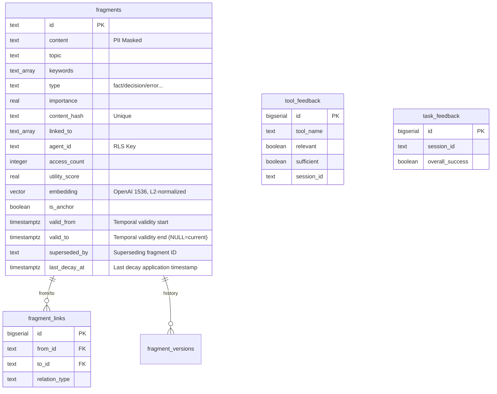

<p align="center">
  
</p>

<p align="center">
  <a href="https://lobehub.com/mcp/jinho-von-choi-memento-mcp">
    
  </a>
</p>

# Memento MCP: A Fragment-Based Persistent Memory Subsystem for Stateless Language Model Agents

---

## Abstract

Contemporary large language model deployments operate under a fundamental architectural constraint: the absence of persistent cross-session state. Each invocation constitutes an epistemically isolated event; context established during one session cannot be recovered in subsequent interactions without explicit external persistence mechanisms. This constraint renders agents incapable of accumulating operational knowledge, tracking error resolution histories, or maintaining user-specific behavioral preferences across session boundaries.

We present **Memento MCP**, a persistent memory subsystem implementing the Model Context Protocol (MCP) specification. The system decomposes agent knowledge into discrete, typed *fragments* — atomic units of information semantically classified into six epistemic categories: `fact`, `decision`, `error`, `preference`, `procedure`, and `relation`. Fragment retrieval is implemented as a three-tier cascading search over Redis Set intersection (L1), PostgreSQL GIN-indexed array queries (L2), and pgvector HNSW approximate nearest-neighbor search (L3), with composite ranking over importance and recency dimensions. A background evaluation worker invokes the Google Gemini CLI to assess stored fragment utility asynchronously. An eleven-stage consolidation pipeline manages TTL tier transitions, importance decay, deduplication, and contradiction detection — the latter implemented as a three-stage hybrid of pgvector similarity filtering, NLI (Natural Language Inference) classification via a local mDeBERTa ONNX model, and Gemini CLI escalation for ambiguous cases. Session termination triggers automatic reflection that converts session activity into structured fragments. The `remember` operation proactively creates typed edges to semantically related fragments via direct pgvector cosine similarity queries. Row-Level Security at the PostgreSQL layer enforces agent-scoped isolation without application-layer filtering overhead.

The server exposes eleven MCP tools, supports protocol versions 2024-11-05 through 2025-11-25, implements both Streamable HTTP and Legacy SSE transports, and provides OAuth 2.0 PKCE authentication. Default listening port is 56332.

---

## Table of Contents

1. Introduction
2. System Architecture
3. Persistence Layer: Schema Design and Indexing
4. Retrieval Architecture: The Three-Tier Cascade
   - 4.6 Performance Characteristics
5. Fragment Lifecycle: TTL Model and Scope Semantics
6. MCP Tool Interface
7. Asynchronous Quality Evaluation: MemoryEvaluator
8. Consolidation Pipeline: MemoryConsolidator (11-stage, NLI + Gemini CLI hybrid)
9. Fault Tolerance and Degradation Behavior
10. Configuration
11. Deployment
12. Endpoint Reference
13. References

---

## 1. Introduction

The statelessness problem in deployed language model systems is well-characterized. Unlike recurrent architectures that maintain hidden state across time steps, transformer-based models operating in a request-response paradigm retain no information beyond the context window of the current invocation. When a session terminates — whether through normal completion, timeout, or network interruption — all accumulated reasoning, intermediate conclusions, and established context are irrecoverably discarded. The subsequent session begins with no prior knowledge of the agent's operational history.

Naïve remediation approaches, such as prepending entire conversation histories to each context window, are computationally prohibitive and semantically inefficient: the signal-to-noise ratio of unstructured historical text degrades rapidly as history accumulates, and fixed context window limits impose hard upper bounds on retrievable history length. The central research question, then, is not whether to persist memory externally, but how to structure external persistence such that retrieval is both efficient and semantically precise.

Memento MCP adopts a *fragment-based* representation. Rather than storing monolithic conversation transcripts, the system decomposes agent knowledge into fine-grained, independently retrievable units. Each fragment is a typed, keyword-annotated, vector-embedded record — independently queryable, linked to related fragments via a typed edge relation, and subject to a lifecycle management policy that governs TTL tier assignment, importance score decay, and eventual expiration. This design mirrors, at an abstract level, the distinction Aristotle drew in *De Memoria et Reminiscentia* between *mneme* (passive retention of impressions) and *anamnesis* (active retrieval through associative search) — though we refrain from asserting neurological correspondence.


The following sections describe the system architecture (§2), the PostgreSQL schema and indexing strategy (§3), the three-tier retrieval cascade (§4), the fragment lifecycle model (§5), the complete MCP tool interface (§6), the asynchronous quality evaluation subsystem (§7), the consolidation pipeline (§8), fault tolerance behavior (§9), the configuration surface (§10), and deployment considerations (§11).


---

## 2. System Architecture

The system decomposes into three structural layers: the HTTP transport layer, the MCP protocol and tool dispatch layer, and the memory subsystem proper.

```
┌────────────────────────────────────────────────────────────────────┐
│                           MCP Client                               │
└───────────────────────────────┬────────────────────────────────────┘
                                │ HTTP (Streamable / Legacy SSE)
┌───────────────────────────────▼────────────────────────────────────┐
│               HTTP Transport Layer  (server.js)                    │
│  POST /mcp   GET /mcp   DELETE /mcp   GET /sse   POST /message     │
│  GET /health   GET /metrics   OAuth 2.0 endpoints                  │
└───────────────────────────────┬────────────────────────────────────┘
                                │ JSON-RPC 2.0 dispatch
┌───────────────────────────────▼────────────────────────────────────┐
│         Protocol & Tool Dispatch  (jsonrpc.js + tool-registry.js)  │
│                       11 MCP Memory Tools                          │
└──────────────┬────────────────────────────────────────────────────┘
               │
┌──────────────▼───────────────────────────────────────────────────┐
│                 Memory Subsystem  (lib/memory/)                    │
│                                                                    │
│  MemoryManager  ──►  FragmentFactory  (PII mask, TF keywords,     │
│       │                               TTL inference, hash)        │
│       ├──►  FragmentStore  ◄──────────────────────────────────┐   │
│       │        │  (PostgreSQL CRUD + Redis L1 sync)           │   │
│       └──►  FragmentSearch                                    │   │
│                │  L1: Redis SINTER                            │   │
│                │  L2: PostgreSQL GIN &&                       │   │
│                └─►L3: pgvector HNSW cosine                    │   │
└────────────────────────────┬──────────────────────────────────┘   │
                             │              Background Workers       │
               ┌─────────────┴──────┐   ┌────────────────────────┐  │
               │       Redis        │   │   MemoryEvaluator      │  │
               │  L1 keyword Sets   │   │   (Gemini CLI)         │  │
               │  Working Memory    │   │   5s polling queue     │  │
               │  Evaluation queue  │   ├────────────────────────┤  │
               │  Session Activity  │   │   MemoryConsolidator   ├──┘
               └────────────────────┘   │   11-stage pipeline    │
                                        │   NLI + Gemini hybrid  │
               ┌────────────────────┐   ├────────────────────────┤
               │   NLI Classifier   │   │   AutoReflect          │
               │  mDeBERTa ONNX CPU │───│   Session close hook   │
               └────────────────────┘   └────────────────────────┘
               ┌────────────────────────┴────────────────────────┐
               │         PostgreSQL  (agent_memory schema)        │
               │  fragments (pgvector HNSW + GIN + RLS)          │
               │  fragment_links     fragment_versions            │
               │  tool_feedback      task_feedback                │
               └──────────────────────────────────────────────────┘
```

### 2.1 System Architecture Diagram


### 2.2 HTTP Transport Layer

`server.js` implements a Node.js HTTP server handling eleven distinct endpoint routes. Two MCP transports are supported concurrently:

- **Streamable HTTP** (MCP specification §2025-03-26 and later): `POST /mcp` receives JSON-RPC 2.0 request bodies; `GET /mcp` establishes a server-sent event stream for server-initiated pushes; `DELETE /mcp` terminates sessions explicitly.
- **Legacy SSE** (MCP specification §2024-11-05): `GET /sse` creates a session and opens the SSE stream; `POST /message?sessionId=<id>` receives JSON-RPC requests whose responses are delivered over the SSE channel.

Operational endpoints: `GET /health` returns structured health status for Redis connectivity, PostgreSQL query execution (`SELECT 1`), and active session counts; `GET /metrics` serves Prometheus-compatible metrics collected via `prom-client`.

OAuth 2.0 endpoints: `GET /.well-known/oauth-authorization-server`, `GET /.well-known/oauth-protected-resource`, `GET /authorize`, `POST /token`. PKCE (`code_challenge` / `code_verifier`) is required for the authorization code flow.

### 2.2 Protocol and Dispatch Layer

`lib/jsonrpc.js` parses incoming JSON-RPC 2.0 envelopes and dispatches to registered method handlers. `lib/tool-registry.js` registers the eleven memory tools exported from `lib/tools/memory.js`. Database access utilities (`lib/tools/db.js`), embedding generation (`lib/tools/embedding.js`), and access statistics (`lib/tools/stats.js`) are internal dependencies not exposed through the MCP tool interface.

### 2.3 Memory Subsystem

`lib/memory/` contains all memory-domain logic:

| Module | Responsibility |
|--------|----------------|
| `MemoryManager.js` | Business logic facade. Singleton. Coordinates all memory operations. |
| `FragmentFactory.js` | Fragment construction, schema validation, keyword extraction, PII masking, TTL inference. |
| `FragmentStore.js` | PostgreSQL CRUD operations; Redis L1 index synchronization on write. |
| `FragmentSearch.js` | Three-tier retrieval cascade orchestration (L1 → L2 → L3, RRF hybrid merge). |
| `FragmentIndex.js` | Redis L1 index management (Set operations per keyword). |
| `MemoryConsolidator.js` | Eleven-stage lifecycle maintenance pipeline (NLI + Gemini CLI hybrid contradiction detection). |
| `MemoryEvaluator.js` | Asynchronous Gemini CLI quality assessment worker. Singleton. |
| `NLIClassifier.js` | Natural Language Inference classifier (mDeBERTa ONNX, CPU-only). Entailment/contradiction/neutral labeling for contradiction detection Stage 2. |
| `SessionActivityTracker.js` | Per-session tool call and fragment activity tracking (Redis Hash). TTL 24h. |
| `AutoReflect.js` | Automatic `reflect` orchestrator triggered on session termination. Gemini CLI summary with minimal fallback. |
| `decay.js` | Half-life constants per fragment type and pure exponential decay computation function. |
| `normalize-vectors.js` | One-time migration script to L2-normalize existing embeddings in the database. |
| `memory-schema.sql` | PostgreSQL DDL for the `agent_memory` schema. |
| `migration-001-temporal.sql` | Schema migration: adds `valid_from`, `valid_to`, `superseded_by` columns and temporal indexes. |
| `migration-002-decay.sql` | Schema migration: adds `last_decay_at` column for idempotent decay tracking. |

Supporting infrastructure modules:

| Module | Responsibility |
|--------|----------------|
| `lib/config.js` | Environment variable binding and typed constant export |
| `lib/auth.js` | Bearer token verification |
| `lib/oauth.js` | OAuth 2.0 PKCE authorization and token endpoint logic |
| `lib/sessions.js` | Session lifecycle management for both transport types; async auto-reflect on close |
| `lib/redis.js` | `ioredis` client initialization with optional Sentinel support |
| `lib/gemini.js` | Google Gemini API/CLI client (CLI preferred when available) |
| `lib/compression.js` | Response compression (gzip / deflate) |
| `lib/metrics.js` | Prometheus metric collectors (`prom-client`) |
| `lib/logger.js` | Winston structured logger with daily log rotation |
| `lib/utils.js` | Origin validation, JSON body parsing, SSE framing |
| `lib/path-validator.js` | Filesystem path sanitization |

External configuration: `config/memory.js` exports `MEMORY_CONFIG`, a module-level constant governing composite ranking weights and stale detection thresholds, decoupled from server source to permit adjustment without code modification.

---

## 3. Persistence Layer: Schema Design and Indexing

All persistent state resides in PostgreSQL under the `agent_memory` schema. The DDL is defined in `lib/memory/memory-schema.sql`.



### 3.1 The `fragments` Table

The central relation. Each row represents one atomic unit of agent knowledge.

| Column | Type | Constraints | Semantics |
|--------|------|-------------|-----------|
| `id` | TEXT | PRIMARY KEY | Fragment identifier. Format: `frag-<16 hex chars>` (crypto.randomBytes) |
| `content` | TEXT | NOT NULL | Knowledge content. ≤300 characters; truncated with ellipsis on overflow |
| `topic` | TEXT | NOT NULL | Categorical label (e.g., `database`, `deployment`, `security`) |
| `keywords` | TEXT[] | NOT NULL DEFAULT '{}' | Search keywords; GIN-indexed. Auto-extracted via TF-based ranking when omitted |
| `type` | TEXT | NOT NULL, CHECK | `fact` / `decision` / `error` / `preference` / `procedure` / `relation` |
| `importance` | REAL | CHECK 0.0–1.0 | Type-specific defaults: `preference`=0.95, `error`=0.9, `decision`=0.8, `procedure`=0.7, `relation`=0.6, `fact`=0.5 |
| `content_hash` | TEXT | UNIQUE NOT NULL | First 16 hex characters of SHA-256 of the redacted, truncated content |
| `source` | TEXT | | Provenance identifier (session ID, tool name, file path) |
| `linked_to` | TEXT[] | DEFAULT '{}' | Adjacent fragment IDs; GIN-indexed for graph traversal |
| `agent_id` | TEXT | NOT NULL DEFAULT 'default' | Agent namespace; RLS isolation key |
| `access_count` | INTEGER | DEFAULT 0 | Retrieval frequency counter; input to `utility_score` computation |
| `accessed_at` | TIMESTAMPTZ | | Timestamp of most recent retrieval |
| `created_at` | TIMESTAMPTZ | DEFAULT NOW() | Creation timestamp |
| `ttl_tier` | TEXT | CHECK | `hot` / `warm` / `cold` / `permanent`. Inferred by `FragmentFactory._inferTTL` at creation |
| `estimated_tokens` | INTEGER | DEFAULT 0 | Token count under cl100k_base encoding; `chars / 4` approximation on encoder unavailability |
| `utility_score` | REAL | DEFAULT 1.0 | Composite utility estimate; updated by `MemoryEvaluator` and `MemoryConsolidator` |
| `verified_at` | TIMESTAMPTZ | DEFAULT NOW() | Timestamp of last quality assessment |
| `embedding` | vector(1536) | | Dense vector via OpenAI `text-embedding-3-small`; L2-normalized to unit length before storage; NULL until generated asynchronously |
| `is_anchor` | BOOLEAN | DEFAULT FALSE | When `TRUE`: exempt from decay, TTL demotion, and expiration deletion |
| `valid_from` | TIMESTAMPTZ | DEFAULT NOW() | Temporal validity interval start. Lower bound for `asOf` point-in-time queries. |
| `valid_to` | TIMESTAMPTZ | | Temporal validity interval end. NULL indicates the currently active record. |
| `superseded_by` | TEXT | | ID of the fragment that supersedes this one. |
| `last_decay_at` | TIMESTAMPTZ | | Timestamp of most recent decay application. Enables idempotent decay: Δt is computed from this column rather than `created_at`. NULL triggers fallback to `COALESCE(accessed_at, created_at, NOW())`. |

**Index inventory:** `content_hash` (UNIQUE B-tree); `topic` (B-tree); `type` (B-tree); `keywords` (GIN); `importance DESC` (B-tree); `created_at DESC` (B-tree); `agent_id` (B-tree); `linked_to` (GIN); `(ttl_tier, created_at)` (composite B-tree); `source` (B-tree); `verified_at` (B-tree); `is_anchor WHERE is_anchor = TRUE` (partial B-tree); `valid_from` (B-tree); `(topic, type) WHERE valid_to IS NULL` (partial B-tree); `id WHERE valid_to IS NULL` (partial UNIQUE).

**HNSW vector index:** Constructed conditionally on `embedding IS NOT NULL`. Parameters: `m = 16` (maximum bidirectional connections per layer), `ef_construction = 64` (dynamic candidate list size during graph construction), distance function `vector_cosine_ops`. This configuration follows the parameter recommendations of Malkov and Yashunin (2018) for moderate-scale approximate nearest-neighbor search, providing logarithmic query complexity O(log n) against brute-force O(n·d) at the cost of bounded recall degradation. The choice of m=16 and ef_construction=64 represents a heuristic default balancing index build time against query recall; operators with distinct recall/latency requirements should tune accordingly.

### 3.2 The `fragment_links` Table

Reifies the typed edge relation between fragments independently of the `linked_to` array on `fragments`. The array provides fast single-hop adjacency lookup; this table provides a normalized, queryable representation amenable to relational operations and graph traversal.

| Column | Type | Constraints |
|--------|------|-------------|
| `id` | BIGSERIAL | PRIMARY KEY |
| `from_id` | TEXT | REFERENCES fragments(id) ON DELETE CASCADE |
| `to_id` | TEXT | REFERENCES fragments(id) ON DELETE CASCADE |
| `relation_type` | TEXT | CHECK: `related` / `caused_by` / `resolved_by` / `part_of` / `contradicts` / `superseded_by` |
| `created_at` | TIMESTAMPTZ | DEFAULT NOW() |

UNIQUE constraint on `(from_id, to_id)` prevents duplicate edges. B-tree indexes on both `from_id` and `to_id`.

### 3.3 The `tool_feedback` Table

Captures instrument-level utility assessments submitted via the `tool_feedback` MCP tool.

| Column | Type | Semantics |
|--------|------|-----------|
| `tool_name` | TEXT | Evaluated tool identifier |
| `relevant` | BOOLEAN | Whether results were pertinent to the stated intent |
| `sufficient` | BOOLEAN | Whether results were adequate for task completion |
| `suggestion` | TEXT | Free-text improvement suggestion |
| `context` | TEXT | Usage context summary |
| `session_id` | TEXT | Session identifier |
| `trigger_type` | TEXT | `sampled` (hook-initiated) / `voluntary` (agent-initiated, default) |
| `created_at` | TIMESTAMPTZ | |

### 3.4 The `task_feedback` Table

Session-granularity effectiveness assessments, populated by the `reflect` tool's `task_effectiveness` parameter.

| Column | Type | Semantics |
|--------|------|-----------|
| `session_id` | TEXT | NOT NULL |
| `overall_success` | BOOLEAN | NOT NULL |
| `tool_highlights` | TEXT[] | Tools of exceptional utility, with rationale |
| `tool_pain_points` | TEXT[] | Tools requiring improvement, with rationale |
| `created_at` | TIMESTAMPTZ | |

### 3.5 The `fragment_versions` Table

Immutable audit log of fragment state prior to each `amend` operation.

| Column | Type | Semantics |
|--------|------|-----------|
| `fragment_id` | TEXT | REFERENCES fragments(id) ON DELETE CASCADE |
| `content` | TEXT | Pre-amendment content |
| `topic` | TEXT | Pre-amendment topic |
| `keywords` | TEXT[] | Pre-amendment keywords |
| `type` | TEXT | Pre-amendment type |
| `importance` | REAL | Pre-amendment importance |
| `amended_at` | TIMESTAMPTZ | DEFAULT NOW() |
| `amended_by` | TEXT | `agent_id` of the amending agent |

### 3.6 Row-Level Security

The `fragments` table has RLS enabled. The isolation policy:

```sql
CREATE POLICY fragment_isolation_policy ON agent_memory.fragments
    USING (
        agent_id = current_setting('app.current_agent_id', true)
        OR agent_id = 'default'
        OR current_setting('app.current_agent_id', true) IN ('system', 'admin')
    );
```

Three access grants are codified: (1) fragments owned by the requesting agent; (2) fragments in the `default` namespace, treated as a shared global knowledge pool accessible — and writable — by all authenticated agents; (3) unrestricted access for maintenance sessions identified as `system` or `admin`.

The `default` namespace is an intentional design decision for shared cross-agent knowledge (e.g., system-wide conventions, shared environment configuration). In multi-agent deployments, any authenticated agent may write to the default namespace. Operators requiring strict namespace isolation should ensure all `remember` calls carry explicit `agentId` values and audit `default`-namespace fragments periodically. The isolation context is established per-transaction via `SET LOCAL app.current_agent_id = $1` prior to query execution, ensuring RLS operates on a per-request rather than per-connection basis.

---

## 4. Prompts: Operational Guidance for AI

Prompts are pre-defined guidelines that help the AI use the memory system more effectively.

| Name | Description | Key Role |
|------|-------------|----------|
| `analyze-session` | Analyze session activity | Guide the AI to extract and store valuable decisions, errors, and procedures from the current conversation. |
| `retrieve-relevant-memory` | Memory retrieval guide | Assist in finding optimal context by combining keyword and semantic search for a specific topic. |
| `onboarding` | System onboarding | Self-guide for the AI to learn when and how to use Memento MCP tools. |

---

## 5. Resources: A Window into System State

Resources allow the AI to retrieve real-time state information of the memory system and include it in the context.

| URI | Description | Data Source |
|-----|-------------|-------------|
| `memory://stats` | System Statistics | Counts by type/tier and average utility scores from the `fragments` table. |
| `memory://topics` | Topic List | List of all unique `topic` labels in the `fragments` table. |
| `memory://config` | System Configuration | Weights and TTL thresholds defined in `MEMORY_CONFIG`. |
| `memory://active-session` | Session Activity Log | Tool invocation history for the current session from `SessionActivityTracker` (Redis). |

---

## 6. Retrieval Architecture: The Three-Tier Cascade

### 6.1 Retrieval Flow Diagram


Fragment retrieval executes as a cascading, cost-ordered search. Tiers are evaluated in ascending computational cost; a tier is skipped when the preceding tier yields a result set of sufficient cardinality.

```
recall(keywords, topic, type, text, ...)
          │
          ▼
┌─────────────────────────────────────────┐
│  L1: Redis SINTER                       │
│  keys: keywords:<kw> (Set per keyword)  │
│  op:   SINTER → fragment ID set         │
│  cost: O(N·K), in-memory, sub-ms        │
└──────────────┬──────────────────────────┘
               │ insufficient results?
               ▼
┌─────────────────────────────────────────┐
│  L2: PostgreSQL GIN Array Query         │
│  op:  keywords && ARRAY[...]            │
│  idx: GIN on fragments.keywords         │
│  cost: index scan, ms range             │
└──────────────┬──────────────────────────┘
               │ text param present, or still insufficient?
               ▼
┌─────────────────────────────────────────┐
│  L3: pgvector HNSW Cosine Similarity    │
│  op:  embedding <=> $query_vector       │
│  idx: HNSW (m=16, ef_construction=64)   │
│  cost: O(log n), ~ms range              │
└──────────────┬──────────────────────────┘
               │
               ▼
        Merge + Composite Rank
        → tokenBudget enforcement
        → includeLinks (1-hop)
        → return fragments
```

### 4.1 L1: Redis Set Intersection

Upon fragment creation, `FragmentIndex` synchronously updates one Redis Set per keyword: each Set keyed `keywords:<keyword>` stores the IDs of all fragments annotated with that keyword. Multi-keyword retrieval reduces to SINTER across the corresponding Sets — time complexity O(N·K) where N is the cardinality of the smallest Set and K is the number of keywords. Execution is sub-millisecond for typical workloads given Redis's in-memory storage model. When Redis is unavailable, L1 is bypassed entirely and retrieval proceeds directly to L2.

### 4.2 L2: PostgreSQL GIN-Indexed Array Query

When L1 yields insufficient results, retrieval escalates to L2. The `keywords` column carries a Generalized Inverted Index (GIN), enabling the array overlap operator `keywords && ARRAY[...]` to execute as an index scan. GIN indexes decompose each array into constituent elements and maintain posting lists per element; the overlap operator resolves to a set intersection over posting lists, returning rows containing at least one matching keyword. No sequential scan is performed.

### 4.3 L3: pgvector HNSW Cosine Similarity Search

L3 is invoked when the `text` parameter is present, explicitly requesting semantic retrieval, or when L1 and L2 together yield insufficient results. The query text is encoded via the OpenAI Embeddings API (`text-embedding-3-small`, 1536 dimensions) and the resulting dense vector is issued against the HNSW index:

```sql
SELECT *, 1 - (embedding <=> $1) AS similarity
FROM agent_memory.fragments
WHERE embedding IS NOT NULL
ORDER BY embedding <=> $1
LIMIT $2
```

The `threshold` parameter filters results where computed cosine similarity falls below the stated minimum. L1/L2 results, which carry no similarity score, are exempt from threshold filtering.

When `OPENAI_API_KEY` is absent or the embedding API call fails, L3 is unavailable. Fragments stored without embeddings are silently excluded from L3 results; they remain accessible via L1 and L2.

### 4.4 Result Merging: RRF Hybrid Fusion and Composite Ranking

When the `text` parameter is present, L2 and L3 execute in parallel via `Promise.all` and their results are fused using Reciprocal Rank Fusion (RRF):

```
rrfScore(f) = Σ_tier weight(tier) / (k + rank_tier(f) + 1)
```

where `k = 60` (MEMORY_CONFIG.rrfSearch.k) is the denominator stabilization constant and L1 results receive a `l1WeightFactor = 2.0` multiplier over L2/L3 to prioritize exact keyword matches. Fragments appearing only in the L1 tier without content fields (not returned by L2 or L3 queries) are filtered out before the final result set is assembled. The `_rrfScore` internal field is stripped before returning results to MCP clients.

When `text` is absent, the cascade falls back to the sequential L1 → L2 → L3 approach, avoiding the parallel execution overhead.

After RRF fusion, composite ranking is applied when the fragment count exceeds `MEMORY_CONFIG.ranking.activationThreshold` (default: 100):

```
rank(f) = importanceWeight × importance(f) + recencyWeight × recency_score(f)
```

where `importanceWeight = 0.6`, `recencyWeight = 0.4` are heuristic defaults empirically calibrated for general-purpose agent workloads. They are not derived from a formal optimization procedure; operators with domain-specific retrieval requirements should adjust via `MEMORY_CONFIG.ranking`. Below the activation threshold, fragments are returned in creation-descending order, avoiding the overhead of composite ranking for small stores.

Token budget enforcement follows ranking: fragments are accumulated in rank order and the sequence is truncated when cumulative `estimated_tokens` exceeds `tokenBudget` (default: 1000). Token counts are computed using `js-tiktoken` with the `cl100k_base` encoding via `encodingForModel("gpt-4")`; when the encoder is unavailable at runtime, a `chars / 4` approximation is applied as fallback.

### 4.5 Linked Fragment Retrieval

When `includeLinks = true` (default), the result set is augmented with one-hop neighbors from `fragment_links`. The `linkRelationType` parameter constrains which edge types are followed; when unspecified, `caused_by`, `resolved_by`, and `related` edges are included. The total number of appended linked fragments is bounded by `MEMORY_CONFIG.linkedFragmentLimit` (default: 10).

### 4.6 Performance Characteristics

No empirical benchmarks have been published for this deployment. The estimates below derive from the asymptotic properties of the underlying data structures and from published performance data for the component technologies (Redis 7.x, PostgreSQL 16, pgvector 0.7). Actual latencies in production will vary with hardware, network topology, index parameters, and fragment store cardinality.

| Tier / Operation | Time Complexity | Expected Latency | Dominant Cost |
|-----------------|-----------------|-----------------|---------------|
| L1 Redis SINTER | O(N·K) | < 1 ms | Network RTT to Redis; N = smallest Set cardinality, K = keyword count |
| L2 PostgreSQL GIN | O(N) per posting list | 1–10 ms | GIN posting list intersection; no sequential scan |
| L3 pgvector HNSW query | O(log n) | 1–5 ms | HNSW graph traversal; n = embedded fragment count |
| L3 embedding generation | network-bound | 50–200 ms | OpenAI Embeddings API round-trip |
| Full cascade (L1 → L3, cached embedding) | — | 5–20 ms | Merge + composite ranking: O(m log m), m = merged result count |
| Full cascade (live embedding) | — | 60–220 ms | Dominated by OpenAI API call |
| MemoryEvaluator job | process-bound | 200–2000 ms | Gemini CLI subprocess; fully asynchronous, non-blocking |
| NLI inference (warm) | O(n) | 50–200 ms | mDeBERTa ONNX CPU; n = token count of input pair |
| Consolidation pipeline (< 10⁴ fragments) | O(n) most stages | < 1 s excl. API calls | Stage 9 embedding backfill bounded by OpenAI call count |

Three further observations merit attention. First, the HNSW index parameters (m=16, ef_construction=64) represent a conservative default; increasing `ef_construction` at build time improves recall at the cost of index size and construction latency. The query-time recall parameter `ef` can be tuned per-request via pgvector's `SET hnsw.ef_search`. Second, composite ranking (§4.4) is activated only when the fragment store exceeds `MEMORY_CONFIG.ranking.activationThreshold` (default: 100); below this threshold, results are returned in creation-descending order, eliminating the sort cost entirely. Third, the token budget enforcement loop is O(k) in the number of returned fragments k, not in total store cardinality n, and contributes negligible latency at typical retrieval set sizes.

---

## 5. Fragment Lifecycle: TTL Model and Scope Semantics

### 5.1 Lifecycle State Transition Diagram


### 5.2 Scope vs. TTL Tier: A Critical Distinction

The `scope` parameter of the `remember` tool and the `ttl_tier` column of `fragments` are orthogonal concepts that share superficially similar vocabulary. Their distinction must be understood clearly to avoid operational errors.

**`scope`** governs *where* a fragment is stored:
- `scope: "permanent"` (default): the fragment is written to the main `fragments` table and persists indefinitely, subject to normal lifecycle management.
- `scope: "session"`: the fragment is written to the working memory partition and is expunged when the session terminates.

**`ttl_tier`** governs *how* the `MemoryConsolidator` treats a fragment over time. The initial tier assignment is computed by `FragmentFactory._inferTTL` based on `type` and `importance` at creation time — independently of `scope`:

| Condition (evaluated in order) | Assigned `ttl_tier` |
|--------------------------------|---------------------|
| `type === "preference"` | `permanent` |
| `importance >= 0.8` | `permanent` |
| `type === "error"` OR `type === "procedure"` | `hot` |
| `importance >= 0.5` | `warm` |
| otherwise | `cold` |

Consequently, `scope: "permanent"` does not imply `ttl_tier: "permanent"`. A `fact` fragment with `importance: 0.6` stored with `scope: "permanent"` receives `ttl_tier: "warm"` and is subject to eventual demotion to `cold` and expiration. A `preference` fragment receives `ttl_tier: "permanent"` regardless of the explicitly supplied `importance` value, and will never be expired by the consolidation pipeline.

The `is_anchor` flag provides an orthogonal mechanism for operator-forced permanence: any fragment with `is_anchor = true` is unconditionally exempt from all lifecycle management operations regardless of its `ttl_tier` value.

### 5.2 TTL Tier Semantics

| Tier | Semantics |
|------|-----------|
| `hot` | Recently created or frequently accessed; protected from demotion for a short window |
| `warm` | Default long-term tier; subject to gradual importance decay and eventual cold demotion |
| `cold` | Low-activity; subject to expiration after type-specific stale thresholds |
| `permanent` | Exempt from all consolidation operations |

Stale detection thresholds (days without access before cold-tier expiration): `procedure`=30, `fact`=60, `decision`=90, all other types=60. Configurable via `MEMORY_CONFIG.staleThresholds`.

---

## 6. MCP Tool Interface

Eleven tools are registered. All are defined in `lib/tools/memory.js` and registered via `lib/tool-registry.js`. No database-layer tools are exposed through the MCP interface.

### 6.1 Tool Interaction Patterns

The eleven tools form three functional clusters:

**Storage cluster:** `remember` persists new knowledge; `amend` modifies existing fragments in place with version archival; `link` establishes typed edges between fragments; `forget` removes fragments.

**Retrieval cluster:** `recall` executes the three-tier cascade; `context` loads session-initialization memory; `graph_explore` traverses causal chains from an error fragment.

**Maintenance and telemetry cluster:** `reflect` converts a session summary to a fragment set at session close (also triggered automatically on session termination via `AutoReflect`); `tool_feedback` records instrument-level utility assessments; `memory_stats` returns aggregate store statistics; `memory_consolidate` triggers the eleven-stage maintenance pipeline.

A canonical session workflow:

```
session open    → context(agentId, tokenBudget)
                  [loads preference + error + procedure fragments]
                  [hints about unreflected prior sessions, if any]

during session  → recall(keywords/text)
                  remember(content, topic, type)
                    └─ auto-link: pgvector similarity scan creates
                       related / resolved_by / superseded_by edges
                  link(fromId, toId, relationType)
                  amend(id, ...) as knowledge evolves
                  tool_feedback(tool_name, relevant, sufficient)

session close   → reflect(summary, decisions, errors_resolved, ...)
                  [converts summary to typed fragments for next session]
                  (or) AutoReflect triggers if agent does not call reflect
                    └─ Gemini CLI summary, or minimal fallback
```

### 6.2 `remember`

Persists a typed knowledge fragment. `FragmentFactory._redactPII` is applied to `content` before storage, masking four categories via regex:

1. **API keys**: patterns matching `sk-[a-zA-Z0-9]{32,}` (OpenAI) and `AIza[0-9A-Za-z\-_]{35}` (Google) → `[REDACTED_API_KEY]`
2. **Email addresses**: RFC 5321 local-part + domain pattern → `[REDACTED_EMAIL]`
3. **Password fields**: `password|passwd|pwd|비밀번호|비번` followed by `:` or `=` and a value → `[REDACTED_PWD]`
4. **Korean mobile numbers**: `01[016789][-\s]?\d{3,4}[-\s]?\d{4}` → `[REDACTED_PHONE]`

Masking is purely destructive; the original content is never stored and cannot be recovered. The `content_hash` is computed from the *redacted, truncated* content, so duplicate detection operates on the masked representation. PII masking applies to the `content` field only; `topic`, `keywords`, and `source` are not processed.

Keyword extraction, when `keywords` is omitted, applies a term-frequency ranking over unigrams after removing a bilingual (Korean/English) stopword list, returning up to five terms with highest frequency.

| Parameter | Type | Required | Description |
|-----------|------|:--------:|-------------|
| `content` | string | Y | Fragment content. ≤300 characters; truncated with ellipsis on overflow. PII masking applied. |
| `topic` | string | Y | Categorical topic label |
| `type` | string | Y | `fact` / `decision` / `error` / `preference` / `procedure` / `relation` |
| `keywords` | string[] | | Search keywords. Auto-extracted via TF ranking when omitted |
| `importance` | number | | [0.0, 1.0]. Type-specific default when omitted. See §3.1 for defaults. |
| `source` | string | | Provenance identifier |
| `linkedTo` | string[] | | Fragment IDs to link at creation time |
| `scope` | string | | `permanent` (default) / `session`. Controls storage layer, not TTL tier. |
| `isAnchor` | boolean | | Exempts from decay, TTL demotion, and expiration when `true` |
| `agentId` | string | | Agent identifier for RLS context. Defaults to `"default"` namespace when omitted. |

Returns: `{ success: true, id: string, created: boolean }`. `created: false` indicates the content hash already existed; the existing fragment is returned.

**Auto-linking behavior:** After successful insertion, `MemoryManager._autoLinkOnRemember` queries pgvector directly for fragments in the same topic with cosine similarity > 0.7. Up to three edges are created automatically: `related` (similarity > 0.7), `resolved_by` (new error fragment resolving a prior error), or `superseded_by` (same type, similarity > 0.85, newer timestamp). This operates only when embeddings are present; fragments without embeddings are skipped. The auto-link step is non-blocking: failures do not affect the `remember` response.

### 6.3 `recall`

Executes the three-tier retrieval cascade. Parameters may be combined freely.

| Parameter | Type | Description |
|-----------|------|-------------|
| `keywords` | string[] | L1 Redis Set intersection keys; also applied as L2 filter |
| `topic` | string | Topic filter applied at all tiers |
| `type` | string | Type filter applied at all tiers |
| `text` | string | Natural language query; forces L3 semantic retrieval and enables parallel L2+L3 execution with RRF merge |
| `tokenBudget` | number | Maximum cumulative token count. Default: 1000 |
| `includeLinks` | boolean | Append 1-hop linked neighbors. Default: `true` |
| `linkRelationType` | string | Edge type filter for linked neighbors. Default: `caused_by`, `resolved_by`, `related` |
| `threshold` | number | Minimum cosine similarity for L3 results [0.0, 1.0]. L1/L2 results are unaffected. |
| `asOf` | string | ISO 8601 datetime (e.g., `"2026-01-15T00:00:00Z"`). Enables point-in-time retrieval: returns only fragments where `valid_from ≤ asOf AND (valid_to IS NULL OR valid_to > asOf)`. Useful for auditing knowledge state at a specific historical moment. |
| `agentId` | string | Agent identifier |

### 6.4 `forget`

Deletes fragments by ID or by topic. `permanent`-tier fragments require `force: true`.

| Parameter | Type | Description |
|-----------|------|-------------|
| `id` | string | Delete a specific fragment by ID |
| `topic` | string | Delete all fragments with the specified topic |
| `force` | boolean | Permit deletion of `permanent`-tier fragments. Default: `false` |
| `agentId` | string | Agent identifier |

### 6.5 `link`

Creates a typed directed edge. Inserts a row into `fragment_links` and appends `toId` to `from_id.linked_to`.

| Parameter | Type | Required | Description |
|-----------|------|:--------:|-------------|
| `fromId` | string | Y | Source fragment ID |
| `toId` | string | Y | Target fragment ID |
| `relationType` | string | | `related` / `caused_by` / `resolved_by` / `part_of` / `contradicts`. Default: `related` |
| `agentId` | string | | Agent identifier |

### 6.6 `amend`

Modifies a fragment in place. Pre-modification state is archived to `fragment_versions`. Fragment ID and all edge relations are preserved.

| Parameter | Type | Required | Description |
|-----------|------|:--------:|-------------|
| `id` | string | Y | Target fragment ID |
| `content` | string | | Replacement content. PII masking applied. Truncated at 300 characters. |
| `topic` | string | | Replacement topic |
| `keywords` | string[] | | Replacement keyword list |
| `type` | string | | Replacement type |
| `importance` | number | | Replacement importance [0.0, 1.0] |
| `isAnchor` | boolean | | Modify anchor status |
| `supersedes` | boolean | | Creates `superseded_by` edge from this fragment to the original; reduces original's importance |
| `agentId` | string | | Agent identifier |

### 6.7 `reflect`

Converts a session summary into a structured fragment set at session termination. Each non-null list parameter generates typed fragments: `decisions` → `decision`; `errors_resolved` → `error`; `new_procedures` → `procedure`; `open_questions` → `fact`. The `summary` string is always persisted as a `fact` fragment.

**Automatic reflection:** When a session terminates (explicit close, expiration, or server shutdown) without the agent having called `reflect`, the `AutoReflect` module triggers automatically. If Gemini CLI is available, it generates a structured summary from `SessionActivityTracker` logs (tools called, keywords searched, fragments created/accessed) and invokes `reflect` with the synthesized parameters. If Gemini CLI is unavailable, a minimal `fact` fragment summarizing the session is created, and the session is marked as "unreflected" for potential future AI-driven reflection. The `context` tool detects unreflected sessions and injects a hint into the AI's prompt.

| Parameter | Type | Required | Description |
|-----------|------|:--------:|-------------|
| `summary` | string | Y | Free-text session summary |
| `sessionId` | string | | Session identifier |
| `decisions` | string[] | | Architectural/technical decisions reached this session |
| `errors_resolved` | string[] | | Errors resolved this session with resolution description |
| `new_procedures` | string[] | | New procedures or workflows established this session |
| `open_questions` | string[] | | Unresolved questions or deferred work items |
| `agentId` | string | | Agent identifier |
| `task_effectiveness` | object | | `{ overall_success: boolean, tool_highlights: string[], tool_pain_points: string[] }`. Persisted to `task_feedback`. |

### 6.8 `context`

Loads memory context at session initialization. Returns Core Memory (high-importance fragments, prefix-injected) and, when `sessionId` is specified, Working Memory (session-scoped fragments appended during the current session). Additionally queries `SessionActivityTracker` for unreflected prior sessions and, when found, injects a hint into the returned context prompting the AI to call `reflect` for those sessions.

| Parameter | Type | Description |
|-----------|------|-------------|
| `tokenBudget` | number | Maximum token count for loaded context. Default: 2000 |
| `types` | string[] | Fragment types to include. Default: `["preference", "error", "procedure"]` |
| `sessionId` | string | Session identifier for Working Memory retrieval |
| `agentId` | string | Agent identifier |

### 6.9 `tool_feedback`

Records a utility assessment for a previously executed tool invocation.

| Parameter | Type | Required | Description |
|-----------|------|:--------:|-------------|
| `tool_name` | string | Y | Identifier of the evaluated tool |
| `relevant` | boolean | Y | Whether results were pertinent to the stated intent |
| `sufficient` | boolean | Y | Whether results were adequate for task completion |
| `suggestion` | string | | Improvement suggestion. ≤100 characters recommended |
| `context` | string | | Usage context summary. ≤50 characters recommended |
| `session_id` | string | | Session identifier |
| `trigger_type` | string | | `sampled` (hook-initiated) / `voluntary` (agent-initiated, default) |

### 6.10 `memory_stats`

Returns aggregate statistics: total fragment count, TTL tier distribution, type-wise counts, embedding coverage ratio, mean utility scores. No parameters.

### 6.11 `memory_consolidate`

Triggers the eleven-stage consolidation pipeline synchronously. Returns per-stage processing counts including NLI statistics (`nliResolvedDirectly`, `nliSkippedAsNonContra`). No parameters. See §8.

### 6.12 `graph_explore`

Performs a one-hop traversal of the causal relation subgraph from a specified origin fragment, following `caused_by` and `resolved_by` edges. Intended for root cause analysis starting from an `error` fragment.

| Parameter | Type | Required | Description |
|-----------|------|:--------:|-------------|
| `startId` | string | Y | Origin fragment ID. `error`-typed fragments are the canonical input. |
| `agentId` | string | | Agent identifier |

---

## 7. Asynchronous Quality Evaluation: MemoryEvaluator

`MemoryEvaluator` is a singleton background worker started at server startup via `getMemoryEvaluator().start()` and halted during graceful shutdown. It implements a polling loop over the Redis queue `memory_evaluation` at a fixed interval of 5,000 ms.

```
server start
    │
    └─► MemoryEvaluator.start()
              │
              └─► _loop()
                    ├── popFromQueue("memory_evaluation")
                    │       │ job present
                    │       └──► evaluate(job)
                    │               ├── Gemini CLI call (geminiCLIJson)
                    │               └── UPDATE fragments SET utility_score, verified_at
                    │       │ queue empty
                    │       └──► sleep(5000ms)
                    └── (repeat)
```

When a fragment is persisted via `remember`, its identifier is enqueued for evaluation. The evaluation path is fully decoupled from the `remember` call to eliminate latency from the synchronous response path. `MemoryEvaluator` assesses informational value, specificity, and actionability of the stored content and updates `utility_score` and `verified_at` accordingly.

The evaluator uses the Gemini CLI (`geminiCLIJson`) rather than the Gemini REST API. If the CLI is not installed (`isGeminiCLIAvailable()` returns `false`), evaluation is skipped entirely — the fragment retains its default `utility_score` of 1.0, and no error is surfaced. When the CLI call fails (timeout, malformed response), the job is processed without updating the fragment and the worker continues. The queue is not retried automatically on transient failures in the current implementation; operators requiring retry semantics should instrument the Redis queue externally.

---

## 8. Consolidation Pipeline: MemoryConsolidator

The consolidation pipeline is an eleven-stage sequential maintenance procedure.

```
memory_consolidate
        │
        ├── Stage 1:  TTL tier transitions (hot→warm→cold, anchors exempt)
        ├── Stage 2:  importance decay (PostgreSQL POWER() batch SQL, type-specific half-lives, idempotent via last_decay_at, anchors exempt)
        ├── Stage 3:  expired fragment deletion (stale thresholds)
        ├── Stage 4:  deduplication (content_hash collision → merge, retain highest-importance)
        ├── Stage 5:  missing embedding backfill (up to 5 per cycle)
        ├── Stage 6:  utility_score recomputation: importance × (1 + ln(max(access_count, 1)))
        ├── Stage 6.5: anchor auto-promotion (access_count ≥ 10 + importance ≥ 0.8)
        ├── Stage 7:  contradiction detection ──── 3-stage hybrid ────
        │                 ├─ 7a: pgvector cosine similarity > 0.85 (candidate filter)
        │                 ├─ 7b: NLI classification (mDeBERTa ONNX, CPU)
        │                 │       ├─ contradiction ≥ 0.8 → resolve immediately
        │                 │       ├─ entailment ≥ 0.6 → skip (not contradictory)
        │                 │       └─ uncertain → escalate to Stage 7c
        │                 └─ 7c: Gemini CLI adjudication (domain/numerical contradictions)
        │                         └─ CLI unavailable → queue to Redis pending list
        ├── Stage 7.5: pending contradiction reprocessing (Redis queue, max 10 per cycle)
        ├── Stage 8:  feedback report generation (tool_feedback/task_feedback aggregation)
        ├── Stage 9:  Redis index pruning + stale fragment collection
        └── Stage 10: aggregate statistics (per-stage counts → return value)
```

**Stage 4 — Deduplication detail:** When multiple fragments share a `content_hash`, the highest-importance fragment is designated the surviving record. All `fragment_links` referencing duplicate fragment IDs are updated to reference the surviving ID before the duplicates are deleted.

**Stage 7 — Contradiction detection detail (3-stage hybrid):**

The contradiction detection pipeline processes only fragments created since the last check (tracked via Redis key `frag:contradiction_check_at`). For each new fragment, candidates are retrieved from the same topic with pgvector cosine similarity > 0.85 (Stage 7a).

Stage 7b applies the NLI classifier (`NLIClassifier.js`) to each candidate pair. The mDeBERTa model produces entailment/contradiction/neutral probabilities in ~50-200ms on CPU. High-confidence contradictions (score >= 0.8) are resolved immediately without an LLM call — this handles clear logical contradictions such as "the server never restarts" vs. "the server restarts daily." Clear entailments (score >= 0.6) are skipped as non-contradictory. This stage typically eliminates 50-70% of candidate pairs from requiring LLM evaluation.

Stage 7c escalates NLI-uncertain cases to Gemini CLI for contextual adjudication. This handles numerical contradictions (e.g., "TTL is 3600s" vs. "TTL is 300s") and domain-specific conflicts that NLI models cannot reason about. When Gemini CLI is unavailable, pairs with similarity > 0.92 are queued to Redis (`frag:pending_contradictions`) for later reprocessing in Stage 7.5.

Confirmed contradictions trigger: (1) a `contradicts` edge in `fragment_links`; (2) a `superseded_by` edge from the older to the newer fragment; (3) importance halving of the older fragment (anchors exempt). The timestamp is updated only for successfully processed fragments, ensuring failed Gemini calls do not cause fragments to be skipped in subsequent cycles.

---

## 9. Fault Tolerance and Degradation Behavior

The system is designed to degrade gracefully rather than fail hard when external dependencies are unavailable.

### 9.1 Redis Unavailability

When the Redis client is not connected or returns an error:
- **L1 retrieval** is skipped entirely; `recall` proceeds directly to L2.
- **Working Memory writes** (`scope: "session"`) fail silently or throw; session-scoped fragments are not persisted.
- **MemoryEvaluator** cannot dequeue jobs; the worker enters its sleep interval and retries on the next polling cycle.
- `memory_stats` and `memory_consolidate` may report degraded statistics for Redis-backed counters.

### 9.2 PostgreSQL Connection Failure

PostgreSQL is a hard dependency. Connection pool exhaustion or server unavailability causes `remember`, `recall`, `forget`, `amend`, and all maintenance operations to throw exceptions, which are caught by the tool handler and returned as `{ success: false, error: <message> }` to the MCP client. The `/health` endpoint reports `database.status: "down"` and returns HTTP 503, enabling load balancer health checks to route traffic appropriately.

### 9.3 OpenAI Embedding API Failure

When embedding generation fails (network error, invalid API key, rate limit, quota exhaustion):
- The fragment is stored without an embedding (`embedding` column remains NULL).
- L3 vector search is unavailable for that fragment until the embedding is backfilled by a subsequent `memory_consolidate` Stage 9 run.
- L1 and L2 retrieval continue to function normally.
- No error is surfaced to the `remember` caller; the operation is reported as successful.

### 9.4 Gemini CLI Unavailability

When the Gemini CLI is not installed or fails:
- **MemoryEvaluator** skips evaluation entirely; the fragment retains its initial `utility_score` of 1.0.
- **Contradiction detection** falls back to NLI-only mode. High-confidence NLI contradictions are still resolved; uncertain cases with similarity > 0.92 are queued to Redis pending list for later reprocessing when the CLI becomes available.
- **AutoReflect** creates a minimal `fact` fragment summarizing session activity and marks the session as "unreflected" rather than generating a full structured summary.

### 9.5 NLI Model Unavailability

When the NLI model (`NLIClassifier.js`) fails to load (download failure, ONNX runtime error, memory constraint):
- Contradiction detection falls back to the pre-NLI behavior: all candidate pairs are sent directly to Gemini CLI, or queued to Redis pending list when CLI is also unavailable.
- The model load failure is cached; subsequent calls return `null` immediately without retry. Server restart is required to re-attempt model loading.
- All other system functionality is unaffected.

### 9.6 Token Encoder Unavailability

If `js-tiktoken` fails to initialize the `cl100k_base` encoder at runtime, `FragmentFactory` falls back to a `Math.ceil(text.length / 4)` character-based approximation. This approximation overestimates token count for CJK-heavy content and underestimates for heavily punctuated ASCII. Operators storing predominantly Korean or Chinese content should ensure the encoder initializes correctly to avoid systematic `tokenBudget` miscalculation.

---

## 10. Configuration

### 10.1 Memory System Configuration

`config/memory.js` exports a single named constant:

```js
export const MEMORY_CONFIG = {
  ranking: {
    // Heuristic defaults. importanceWeight + recencyWeight must equal 1.0.
    // Adjust for domain-specific retrieval characteristics.
    importanceWeight   : 0.6,
    recencyWeight      : 0.4,
    activationThreshold: 100   // Composite ranking activates above this fragment count
  },
  staleThresholds: {
    // Days of inactivity before cold-tier expiration.
    procedure: 30,
    fact      : 60,
    decision  : 90,
    default   : 60
  },
  halfLifeDays: {
    // Exponential decay half-lives in days. importance × 2^(−Δt/halfLife).
    // Δt measured from last_decay_at (idempotent); falls back to accessed_at / created_at.
    procedure : 30,
    fact      : 60,
    decision  : 90,
    error     : 45,
    preference: 120,
    relation  : 90,
    default   : 60
  },
  rrfSearch: {
    k             : 60,   // RRF denominator constant. Higher k reduces top-rank dominance.
    l1WeightFactor: 2.0   // Multiplier applied to L1 Redis results for priority injection.
  },
  linkedFragmentLimit: 10  // Max linked neighbors returned per recall
};
```

`halfLifeDays` controls the exponential decay rate independently of `staleThresholds`; a fragment may still be active (not yet cold) while its importance has already decayed significantly. The `rrfSearch.k = 60` default follows the canonical Cormack, Clarke, and Buettcher (2009) recommendation for web retrieval; domain-specific corpora with tighter rank distributions may benefit from lower values.

### 10.2 Environment Variables

#### Server

| Variable | Default | Description |
|----------|---------|-------------|
| `PORT` | `56332` | TCP port for the HTTP listener |
| `MEMENTO_ACCESS_KEY` | (empty) | Bearer token for authentication. Authentication disabled when empty. |
| `SESSION_TTL_MINUTES` | `60` | Session expiration interval in minutes |
| `LOG_DIR` | `/var/log/mcp` | Winston log file directory |
| `ALLOWED_ORIGINS` | (empty) | Comma-separated allowed Origin values. All origins permitted when empty. |

#### PostgreSQL

`POSTGRES_*` variables take precedence over `DB_*` equivalents. Both forms are accepted.

| Variable | Description |
|----------|-------------|
| `POSTGRES_HOST` / `DB_HOST` | Database server hostname |
| `POSTGRES_PORT` / `DB_PORT` | Port. Default: `5432` |
| `POSTGRES_DB` / `DB_NAME` | Database name |
| `POSTGRES_USER` / `DB_USER` | Database user |
| `POSTGRES_PASSWORD` / `DB_PASSWORD` | Database password |
| `DB_MAX_CONNECTIONS` | Pool maximum size. Default: `20` |
| `DB_IDLE_TIMEOUT_MS` | Idle connection eviction timeout (ms). Default: `30000` |
| `DB_CONN_TIMEOUT_MS` | Connection acquisition timeout (ms). Default: `10000` |
| `DB_QUERY_TIMEOUT` | Query execution timeout (ms). Default: `30000` |

#### Redis

| Variable | Default | Description |
|----------|---------|-------------|
| `REDIS_ENABLED` | `false` | Enables Redis. When `false`, L1 retrieval and caching are disabled. |
| `REDIS_SENTINEL_ENABLED` | `false` | Activates Sentinel high-availability mode |
| `REDIS_HOST` | `localhost` | Redis server hostname |
| `REDIS_PORT` | `6379` | Redis server port |
| `REDIS_PASSWORD` | (empty) | Redis authentication password |
| `REDIS_DB` | `0` | Redis logical database index |
| `REDIS_MASTER_NAME` | `mymaster` | Sentinel master name |
| `REDIS_SENTINELS` | `localhost:26379,...` | Comma-separated `host:port` Sentinel node list |

#### Caching

| Variable | Default | Description |
|----------|---------|-------------|
| `CACHE_ENABLED` | Inherits `REDIS_ENABLED` | Enables query result caching |
| `CACHE_DB_TTL` | `300` | Database query cache TTL (seconds) |
| `CACHE_SESSION_TTL` | `SESSION_TTL_MS / 1000` | Session cache TTL (seconds) |

#### AI Services

| Variable | Default | Description |
|----------|---------|-------------|
| `OPENAI_API_KEY` | (empty) | OpenAI API key for embedding generation. L3 retrieval and auto-linking unavailable when absent. |
| `EMBEDDING_MODEL` | `text-embedding-3-small` | Embedding model identifier |
| `EMBEDDING_DIMENSIONS` | `1536` | Embedding dimensionality. Must match `vector(N)` in the schema. |
| `GEMINI_API_KEY` | (empty) | Google Gemini API key for legacy API mode. Gemini CLI is preferred when installed; this key is used as fallback. |

**NLI model:** The NLI classifier (`@huggingface/transformers` + ONNX Runtime) requires no API key. The mDeBERTa model (~280MB ONNX) is downloaded automatically on first use and cached locally. No GPU is required; inference runs on CPU via ONNX Runtime.

**Gemini CLI:** When the `gemini` CLI is installed and available on `$PATH`, it is used in preference to the REST API for all Gemini operations (fragment evaluation, contradiction adjudication, auto-reflect summary generation). Install via `npm install -g @anthropic/gemini-cli` or the platform-specific package manager.

---

## 11. Deployment

### 11.1 Schema Initialization

**Fresh install:**

```bash
psql -U $POSTGRES_USER -d $POSTGRES_DB -f lib/memory/memory-schema.sql
```

**Upgrade from a prior version** (run migrations in order):

```bash
# Temporal schema: adds valid_from, valid_to, superseded_by columns and indexes
psql $DATABASE_URL -f lib/memory/migration-001-temporal.sql

# Decay idempotency: adds last_decay_at column
psql $DATABASE_URL -f lib/memory/migration-002-decay.sql

# One-time L2 normalization of existing embeddings (safe to re-run; idempotent)
DATABASE_URL=$DATABASE_URL node lib/memory/normalize-vectors.js
```

The `pgvector` extension must be installed prior to schema initialization:

```sql
CREATE EXTENSION IF NOT EXISTS vector;
```

Verify with `\dx` in psql. The HNSW index requires pgvector 0.5.0 or later.

### 11.2 Server Startup

```bash
npm install
node server.js
```

On startup, the server logs the listening port, authentication status, session TTL, confirms `MemoryEvaluator` worker initialization, and begins NLI model preloading in the background (~30s on first download, ~1-2s from cache). Graceful shutdown on `SIGTERM` / `SIGINT` triggers `AutoReflect` for all active sessions, stops `MemoryEvaluator`, drains the PostgreSQL connection pool, and flushes access statistics.

**Note on ONNX Runtime and CUDA:** On systems with CUDA 11 installed, `npm install` may fail during `onnxruntime-node` post-install. Use `npm install --onnxruntime-node-install-cuda=skip` to force CPU-only mode. This project does not require GPU acceleration.

### 11.3 MCP Client Configuration

Store the access key in an environment variable; do not commit plaintext credentials.

```json
{
  "mcpServers": {
    "memento": {
      "type": "http",
      "url": "http://localhost:56332/mcp",
      "headers": {
        "Authorization": "Bearer ${MEMENTO_ACCESS_KEY}"
      }
    }
  }
}
```

For external access, expose the service through a reverse proxy (TLS termination, rate limiting). Do not publish internal host addresses or port numbers in external documentation.

### 11.4 MCP Protocol Version Negotiation

| Version | Notable Additions |
|---------|------------------|
| `2025-11-25` | Tasks abstraction, long-running operation support |
| `2025-06-18` | Structured tool output, server-driven interaction |
| `2025-03-26` | OAuth 2.1, Streamable HTTP transport |
| `2024-11-05` | Initial release; Legacy SSE transport |

The server advertises all four versions. Clients negotiate the highest mutually supported version during `initialize`.

---

## 12. Endpoint Reference

| Method | Path | Description |
|--------|------|-------------|
| `POST` | `/mcp` | Streamable HTTP: receive JSON-RPC 2.0 request |
| `GET` | `/mcp` | Streamable HTTP: open SSE stream for server push |
| `DELETE` | `/mcp` | Streamable HTTP: terminate session |
| `GET` | `/sse` | Legacy SSE: create session (`accessKey` query parameter) |
| `POST` | `/message?sessionId=` | Legacy SSE: receive JSON-RPC 2.0 request |
| `GET` | `/health` | Health check: Redis, PostgreSQL, session counts; HTTP 503 on degraded |
| `GET` | `/metrics` | Prometheus metrics (prom-client) |
| `GET` | `/.well-known/oauth-authorization-server` | OAuth 2.0 authorization server metadata |
| `GET` | `/.well-known/oauth-protected-resource` | OAuth 2.0 protected resource metadata |
| `GET` | `/authorize` | OAuth 2.0 authorization endpoint (PKCE required) |
| `POST` | `/token` | OAuth 2.0 token endpoint (authorization code exchange) |

---

## 13. References

Malkov, Y. A., & Yashunin, D. A. (2018). Efficient and robust approximate nearest neighbor search using hierarchical navigable small world graphs. *IEEE Transactions on Pattern Analysis and Machine Intelligence*, 42(4), 824–836.

Aristotle. *De Memoria et Reminiscentia* [On Memory and Recollection]. Translated by J. I. Beare. In *The Works of Aristotle*, Vol. III. Oxford University Press, 1931.

PostgreSQL Global Development Group. (2024). *PostgreSQL 16 Documentation: GIN Indexes*. https://www.postgresql.org/docs/16/gin.html

pgvector. (2024). *Open-source vector similarity search for Postgres*. https://github.com/pgvector/pgvector

Hardt, D., Ed. (2012). *The OAuth 2.0 Authorization Framework*. RFC 6749. IETF.

Sakaguchi, K., Bras, R. L., Bhagavatula, C., & Choi, Y. (2021). WinoGrande: An adversarial winograd schema challenge at scale. *Communications of the ACM*, 64(9), 99–106.

---

*Memento MCP — Fragment-Based Persistent Memory for Language Model Agents*
*Author: Jinho Choi — jinho.von.choi@nerdvana.kr*
