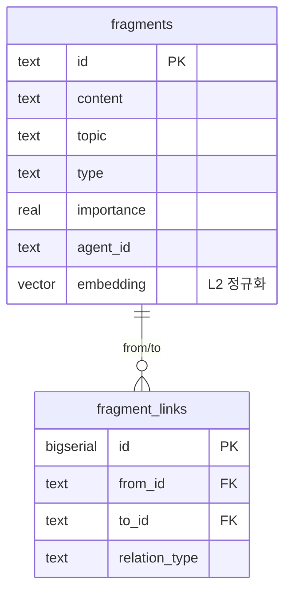
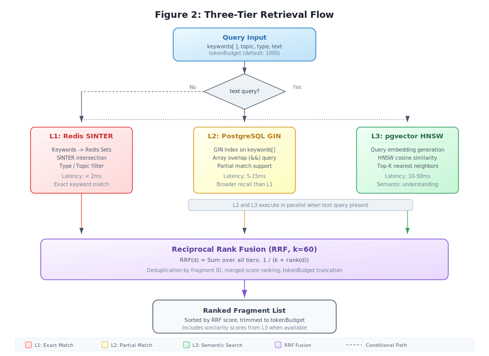
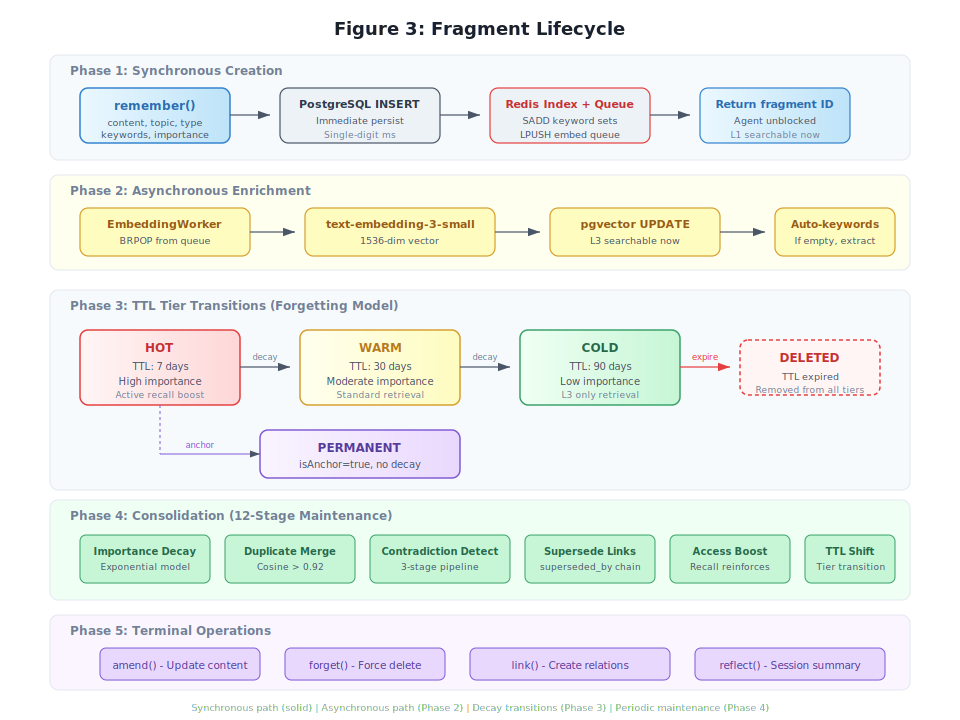
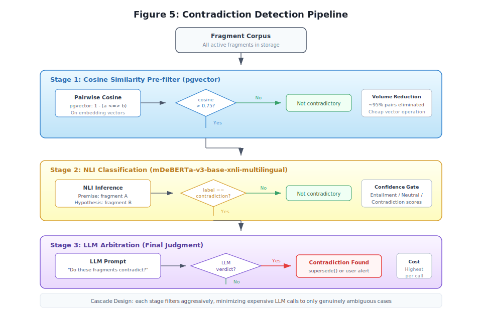

<p align="center">
  
</p>

<p align="center">
  <a href="https://lobehub.com/mcp/jinho-von-choi-memento-mcp">
    
  </a>
</p>

# Memento MCP

빠른 진입 경로:

- [Quick Start](docs/getting-started/quickstart.md)
- [Windows WSL2 Setup](docs/getting-started/windows-wsl2.md)
- [Windows PowerShell Setup](docs/getting-started/windows-powershell.md)
- [Claude Code Configuration](docs/getting-started/claude-code.md)
- [First Memory Flow](docs/getting-started/first-memory-flow.md)
- [Troubleshooting](docs/getting-started/troubleshooting.md)

## 5분 시작

```bash
cp .env.example.minimal .env
# .env 값을 편집한 뒤 셸에 반영
export $(grep -v '^#' .env | grep '=' | xargs)
npm install
psql "$DATABASE_URL" -c "CREATE EXTENSION IF NOT EXISTS vector;"
psql "$DATABASE_URL" -f lib/memory/memory-schema.sql
node server.js
```

설치 후에는 [First Memory Flow](docs/getting-started/first-memory-flow.md)로 첫 기억 저장/조회가 되는지 확인한다.

---

ChatGPT나 Claude 써봤으면 알 거임. 대화 창 닫고 다시 열면 어제 3시간 같이 작업한 거 싹 잊어버리고 "안녕하세요! 무엇을 도와드릴까요?" 이러고 있음.

회사에 신입 직원 뽑았는데 매일 아침 출근할 때마다 기억을 리셋하고 오는 거랑 같음. 어제 가르쳐준 거 다 잊어버리고, 회사 시스템도 모르고, 네 취향도 모르고, 지난주에 같이 해결한 문제도 기억 못함. 매일 처음부터 다시 설명해야 됨.

Memento MCP는 이 문제를 해결하는 용도로 만들어졌음.

---

## 왜 이름이 Memento임?

영화 메멘토(Memento, 2000) 알지? 주인공이 단기 기억 상실증 걸려서 10분마다 기억이 리셋되는데, 몸에 문신 새기고 폴라로이드 사진에 메모 써붙이면서 기억을 유지하는 영화. AI도 메멘토 주인공처럼 매 세션마다 기억이 리셋되는데, 이 프로그램이 그 문신이랑 메모 역할을 해주는 거임.

---

## 1. 기존 해결책들이 왜 별로냐

"그냥 대화 내용 통째로 저장하면 되는 거 아님?" 생각할 수 있는데, 구조적인 문제가 있음.

AI와 대화한다는 건 네가 말 한마디를 할 때마다 지금까지의 대화 내용 전부를 다시 보내서 거기서 AI가 맥락을 읽고 답하는 거임. 즉, 대화가 길어질수록 매 메시지마다 토큰이 N+@배로 늘어남. 세션 오래되면 고장나는 것도 그래서임.

거기에 마크다운 개인화 세팅도 한계가 있음. 파편 수가 늘면 관리가 안 되고, 오픈클로 기준으로 그냥 "헬로~" 한마디 하는 것만으로도 4만 토큰이 소모됨.

통째로 때려박으면:
- 관련 없는 내용까지 전부 들어와서 토큰 낭비
- 정보가 너무 많아서 AI가 정작 중요한 내용을 못 찾는 경우 발생
- 한 번에 넣을 수 있는 토큰에도 제한이 있음

---

## 2. 그래서 이 프로그램이 뭘 하냐

핵심 아이디어는 딱 하나임: 기억을 쪼개서 저장하자.

통째로 저장하는 게 아니라, 중요한 사실 하나하나를 **파편(fragment)** 이라는 단위로 쪼개서 저장함. 그리고 나중에 필요한 파편만 골라서 AI한테 먹임.

실제로 이렇게 됨:

- "이 프로젝트는 Node.js 20 씀" → 파편 하나
- "배포할 때 npm run build 먼저 해야 함" → 파편 하나
- "Redis 연결 안 될 때는 비밀번호 환경변수 확인해라" → 파편 하나

"배포 어떻게 해?" 라고 물어볼 때 배포 관련 파편만 골라서 AI한테 줌. 데이터베이스 설정이나 Redis 에러 내용은 이번엔 필요 없으니까 안 줘도 됨. 토큰 절약, AI 혼란 방지.

> "Redis Sentinel 연결 실패 시 REDIS_PASSWORD 환경변수 누락을 먼저 확인할 것. NOAUTH 에러가 증거다."

이게 파편 하나다. 필요한 사실만 꺼내온다.

---

## 3. 파편의 6가지 유형

각 유형마다 기본 중요도와 망각 속도가 다르다.

| 유형 | 설명 | 예시 | 망각 |
|------|------|------|------|
| `fact` | 사실 | "이 프로젝트는 Node.js 20을 쓴다" | 가능 |
| `decision` | 기술/아키텍처 결정 | "커넥션 풀 최대값은 20으로 결정" | 가능 |
| `error` | 에러 패턴 | "pg는 ssl:false 없이 로컬 연결 실패" | **불가** |
| `preference` | 사용자 선호 | "코드 주석은 한국어로 작성" | **불가** |
| `procedure` | 반복 절차 | "배포: 테스트 -> 빌드 -> push -> apply" | 가능 |
| `relation` | 의존 관계 | "auth 모듈은 redis에 의존한다" | 가능 |

`preference`와 `error`는 감쇠하지 않는다. 중요도와 무관하게 만료 삭제 대상에서 제외된다.

---

## 데이터베이스 스키마

스키마명은 `agent_memory`다.



전체 스키마는 [README.md](README.md)의 데이터베이스 스키마 섹션을 참조한다.

- **fragments**: 모든 기억의 원자 단위 (300자 이내). 임베딩은 L2 정규화 단위 벡터로 저장
- **fragment_links**: 파편 간의 인과/해결/구성 관계망
- **tool_feedback**: 도구 사용 결과에 대한 유용성 피드백
- **task_feedback**: 세션 전체의 작업 성공 여부 기록

---

## 프롬프트 & 리소스

### 프롬프트 (Prompts)
- `analyze-session`: 현재 대화에서 중요한 정보를 추출하도록 유도
- `retrieve-relevant-memory`: 특정 주제에 대한 입체적 검색 가이드
- `onboarding`: AI가 시스템 사용법을 스스로 학습

### 리소스 (Resources)
- `memory://stats`: 시스템 전체 통계 정보
- `memory://topics`: 저장된 주제 레이블 목록
- `memory://config`: 시스템 가중치 및 설정
- `memory://active-session`: 현재 세션의 활동 로그

---

## 4. 삼층 캐스케이드 검색

비용이 낮은 계층부터 순서대로 검색한다. 앞 계층에서 충분한 결과가 나오면 뒤 계층은 실행하지 않는다.




| 계층 | 엔진 | 방식 | 속도 |
|------|------|------|------|
| **L1** | Redis 역인덱스 | 키워드 교집합으로 파편 ID 즉시 조회 | 마이크로초 |
| **L2** | PostgreSQL GIN | topic, type, keywords 조합 정형 쿼리 | 밀리초 |
| **L3** | pgvector HNSW | OpenAI L2 정규화 임베딩 기반 의미 검색. "인증 실패"와 "NOAUTH"가 같은 뜻이라는 걸 여기서 안다 | 수십~수백ms |

`text` 파라미터가 있으면 L2와 L3가 병렬 실행되고 결과를 RRF(Reciprocal Rank Fusion)로 병합한다. L1 결과는 2배 가중치를 받아 최우선 주입된다. 키워드만 있으면 기존 방식(L1→L2→L3 폴백)으로 작동한다.

여기에 **시계열 그래프**도 적용됨. 예를 들어 몇 년간 쓰던 서버를 한 달 전에 옮겨서 세팅이 바뀌었어. 그럼 "서버 세팅 뭐지?" 하면 지금 기준으로 가장 가까운 기억을 불러옴. 근데 "작년 5월에 이거 했었는데 세팅 뭐였지?" 라고 물어보면 그 시점 기준으로 가까운 기억 + 연관성으로 가져옴. (`recall`에 `asOf` 파라미터로 시점 지정 가능)

Redis와 OpenAI는 선택 사항이다. 없으면 해당 레이어 없이 작동한다. PostgreSQL만으로도 기본 기능은 돌아감.

---

## 5. TTL 계층

파편은 사용 빈도에 따라 `hot`, `warm`, `cold`, `permanent` 사이를 이동한다.



```
hot (자주 참조됨) → warm (한동안 침묵) → cold (오래 잠듦) → TTL 만료 시 삭제
                          ↑
                    다시 참조되면 hot으로 복귀
```

다시 참조되면 hot으로 복귀한다.

---

## 5-1. 앵커(Anchor): 개인화의 핵심

세션이 시작할 때 `context` 도구가 자동으로 가장 먼저 로딩하는 파편들이 있음. 이게 **앵커(anchor)**로 지정된 파편들임.

`isAnchor: true`로 표시된 파편은:
- TTL 감쇠 없음 — 아무리 오래 안 써도 삭제 안 됨
- 세션 시작 시 최우선 주입 대상
- `memory_consolidate`의 GC 대상에서 영구 제외

개인화 마크다운 따로 세팅할 필요가 없어짐. "코드 주석은 한국어로", "배포 서버는 xxx", "이 프로젝트는 Node.js 20" 같은 거 앵커로 박아두면 세션 시작할 때 알아서 주입됨.

---

## 6. MCP 도구 12개

| 도구 | 설명 |
|------|------|
| `context` | 세션 시작 시 핵심 기억 로드. 이전에 reflect 안 된 세션이 있으면 알려줌 |
| `remember` | 파편 저장. 저장 시 같은 주제의 유사 파편을 pgvector로 찾아 관계를 자동 연결 |
| `recall` | 삼층 캐스케이드 검색 |
| `reflect` | 세션 종료 시 경험을 파편으로 응고. sessionId만 넘겨도 세션 파편 종합. 안 불러도 세션 닫힐 때 자동 실행됨 (AutoReflect) |
| `forget` | 파편 삭제 (해결된 에러 정리용) |
| `link` | 파편 간 인과 관계 설정 (`caused_by`, `resolved_by` 등) |
| `amend` | 파편 내용 수정 (ID와 관계는 보존) |
| `graph_explore` | 인과 체인 탐색 (장애 근본 원인 추적) |
| `memory_stats` | 저장소 통계 |
| `memory_consolidate` | 주기적 유지보수 (감쇠, 병합, NLI+Gemini 하이브리드 모순 탐지). 감쇠는 POWER() 배치 SQL로 처리, 유형별 반감기 적용, last_decay_at 기준 멱등성 보장 |
| `fragment_history` | 파편의 전체 변경 이력 조회 (amend 이전 버전 + superseded_by 체인) |
| `tool_feedback` | 검색 품질 피드백 |

---

## 7. 권장 사용 흐름

```
1) 세션 시작  → context()로 기억 로드
               (이전에 정리 안 된 세션 있으면 힌트도 같이 옴)

2) 작업 중    → 중요한 결정/에러/절차 발생 시 remember()
               (유사 파편 자동 연결됨)
             → 과거 경험 필요할 때 recall()
             → 에러 해결 시 forget(에러) + remember(해결 절차)

3) 세션 종료  → reflect()로 세션 내용 영속화
               까먹고 안 불러도 세션 닫힐 때 자동 실행됨
```

---

## 8. 기술 스택

| 구성요소 | 필수 여부 | 역할 |
|----------|-----------|------|
| Node.js 20+ | 필수 | 런타임 |
| PostgreSQL 14+ (pgvector) | 필수 | 파편 저장, L2 검색, 벡터 검색 |
| Redis 6+ | 선택 | L1 캐시 검색, 세션 활동 추적 |
| Embedding API (OpenAI / Gemini / Ollama / LocalAI / Custom) | 선택 | L3 시맨틱 검색 + 자동 링크. `EMBEDDING_PROVIDER`로 전환 |
| Gemini CLI | 선택 | 품질 평가, 모순 에스컬레이션, 자동 reflect |
| NLI 모델 (mDeBERTa ONNX) | 자동 포함 | 논리적 모순 즉시 탐지. CPU 전용, GPU 불필요 |
| MCP Protocol | 2025-11-25 | 통신 규격 |

PostgreSQL만 있으면 기본 기능이 동작한다. Redis 추가 시 L1 캐시 검색이 활성화되고, Embedding API 추가 시 L3 시맨틱 검색과 자동 링크가 활성화된다. NLI 모델은 자동 설치되어 논리적 모순을 탐지한다. Gemini CLI 추가 시 수치/도메인 모순 처리 및 자동 reflect까지 동작한다. 구성요소는 필요에 따라 선택적으로 추가할 수 있다.

### /health 엔드포인트

- PostgreSQL 장애 시: 503 (서비스 불가)
- Redis 장애 시: 200 (정상, 캐시만 비활성화)

### 임베딩 공급자 설정

설정 예시: `.env.example` 파일 참조.

| 환경변수 | 설명 | 기본값 |
|----------|------|--------|
| `EMBEDDING_PROVIDER` | 임베딩 공급자: `openai` \| `gemini` \| `ollama` \| `localai` \| `custom` | `openai` |
| `EMBEDDING_API_KEY` | 범용 임베딩 API 키 (미설정 시 `OPENAI_API_KEY` 사용) | `""` |
| `GEMINI_API_KEY` | Google Gemini API 키 | `""` |
| `OAUTH_ALLOWED_REDIRECT_URIS` | OAuth 리다이렉트 허용 목록 (쉼표 구분) | `""` |

#### Gemini 사용 시

```env
EMBEDDING_PROVIDER=gemini
GEMINI_API_KEY=AIza...
```

최초 전환 시 기본 스키마(1536차원)를 3072차원 halfvec으로 변환해야 한다:

```bash
EMBEDDING_DIMENSIONS=3072 DATABASE_URL=$DATABASE_URL node lib/memory/migration-007-flexible-embedding-dims.js
```

#### Ollama 사용 시

```env
EMBEDDING_PROVIDER=ollama
```

---

## 9. 실행 방법

```bash
# 신규 설치: PostgreSQL 스키마 초기화
psql -U postgres -c "CREATE EXTENSION IF NOT EXISTS vector;"
psql -U postgres -d memento -f lib/memory/memory-schema.sql

# 기존 설치 업그레이드: 마이그레이션 순서대로 실행
psql $DATABASE_URL -f lib/memory/migration-001-temporal.sql      # Temporal 컬럼 추가
psql $DATABASE_URL -f lib/memory/migration-002-decay.sql         # last_decay_at 추가
psql $DATABASE_URL -f lib/memory/migration-003-api-keys.sql      # API 키 관리 테이블 추가
psql $DATABASE_URL -f lib/memory/migration-004-key-isolation.sql # fragments.key_id 격리 컬럼 추가
psql $DATABASE_URL -f lib/memory/migration-005-gc-columns.sql    # GC 보조 컬럼 추가
psql $DATABASE_URL -f lib/memory/migration-006-superseded-by-constraint.sql # superseded_by FK 제약 추가
psql $DATABASE_URL -f lib/memory/migration-008-morpheme-dict.sql  # 형태소 사전 테이블 추가
psql $DATABASE_URL -f lib/memory/migration-009-co-retrieved.sql  # co-retrieval 링크 추가
psql $DATABASE_URL -f lib/memory/migration-010-ema-activation.sql # EMA 활성화 컬럼 추가
psql $DATABASE_URL -f lib/memory/migration-011-key-groups.sql    # API 키 그룹 관리 테이블 추가
psql $DATABASE_URL -f lib/memory/migration-012-quality-verified.sql # 품질 검증 컬럼 추가
psql $DATABASE_URL -f lib/memory/migration-013-search-events.sql # 검색 이벤트 관측성 테이블 추가

> **v1.1.0 이전 업그레이드 필독**: migration-006 미실행 시 `amend`/`memory_consolidate` 등에서 DB 에러 발생.

# 2000차원 초과 모델(Gemini 등) 사용 시에만:
# EMBEDDING_DIMENSIONS=3072 DATABASE_URL=$DATABASE_URL node lib/memory/migration-007-flexible-embedding-dims.js
DATABASE_URL=$DATABASE_URL node lib/memory/normalize-vectors.js  # 임베딩 L2 정규화 (1회)

# 서버 실행
npm install
# (팁) CUDA 설치 오류 시: npm install --onnxruntime-node-install-cuda=skip
npm start
```

MCP 클라이언트 설정에 아래를 추가하면 된다.

```json
{
  "mcpServers": {
    "memento": {
      "url": "http://localhost:57332/mcp",
      "headers": {
        "Authorization": "Bearer your-secret-key"
      }
    }
  }
}
```

---

## 10. 시스템 구조


---

## 11. 만들게 된 계기

실무에서 Claude를 쓰면서 매일 같은 맥락을 반복 설명하는 게 비효율적이라 느꼈다. 시스템 프롬프트에 메모를 넣는 방법도 써봤지만 한계가 명확했음. 파편 수가 늘어나면 관리가 안 되고, 검색이 안 되고, 오래된 정보와 새 정보가 충돌함.

개열받는건 이미 설명한 것, 세팅한것을 무한히 반복하게 만든다는 것이다. 내가 편하려고 AI를 쓰는 것인데 인증 정보가 없다고 해서 보면 있고 세팅 안돼있다고 해서 세팅 파일 직접 열어보면 다 돼 있고 어떤 세션의 AI는 이상할정도로 곤조를 부려대서 있는것도 없다 하고 할 수 있는걸 못한다고 뻗대면서 고집을 부린다. 철저하게 논파해서 말 잘듣게 해 봐야 그 때 뿐이다. 세션을 다시 시작하면 똑같은 일이 또 다시 반복된다.

마치 명문대를 수석 졸업했지만 매일 같이 뇌가 리셋되는 병을 앓고 있는 신입사원의 교육담당자가 된 느낌이었다.

이러한 고충을 해소하기 위해 기억을 원자 단위로 분해하고, 계층적으로 검색하고, 시간에 따라 자연스럽게 망각하는 시스템을 설계했다. 인간이 망각의 동물인 것 처럼, 이 시스템은 "적절한 망각"을 포함한 기억을 지향한다.

피드백, 이슈, PR 모두 환영.

---

## 사용 팁: 훅으로 더 똑똑하게

MCP 서버가 AI에게 기억 도구 사용을 권장하지만, 세션 시작 시 자동으로 과거 기억을 불러오지는 않는다. `CLAUDE.md`에 아래 지시를 추가하면 AI가 스스로 context를 로드한다:

```markdown
## 세션 시작 규칙
- 대화 시작 시 `context` 도구를 호출하여 Core Memory를 로드한다.
- 에러/코드 작업 전 `recall(keywords=[관련_키워드])`로 관련 기억을 먼저 확인한다.
```

Claude Code `SessionStart` 훅에 `context` 도구 호출을 등록하면 완전 자동화된다. 세션마다 처음 만나는 사람처럼 행동하는 현상이 크게 줄어든다.

---

## FAQ

<details>
<summary>변화하는 사실이나 결정은 어떻게 처리하나?</summary>

`amend`라는 도구로 내용만 덮어쓸 수 있음. ID는 그대로라서 연결된 관계도 안 끊어짐. 예를 들어 "배포 서버는 A"라는 기억이 있었는데 B로 바뀌었으면, 그 파편만 수정하면 "A 서버에서 에러 났었음 -> 이렇게 해결함" 같은 연결 고리가 그대로 살아 있음.

그리고 주기적으로 `memory_consolidate`를 돌리면, 서로 모순되는 파편을 3단계로 잡아냄. 먼저 pgvector가 비슷한 놈들을 추려내고, NLI(자연어추론) 모델이 "이거 모순이다/아니다"를 판정함. "서버는 절대 재시작 안 함" vs "매일 3시에 재시작함" 같은 논리적 모순은 NLI가 0.98 신뢰도로 즉시 잡음. Gemini 호출 없이. "최대값 20" vs "최대값 50" 같은 수치 모순은 NLI가 "잘 모르겠는데?" 하면 그때만 Gemini CLI로 넘김. 모순 확인되면 새 파편이 이기고, 옛날 파편 중요도는 반토막남.

중요도 감쇠는 PostgreSQL `POWER()` 하나짜리 SQL로 배치 처리됨. 공식: `importance × 2^(−Δt/반감기)`. 유형마다 반감기가 다름 (procedure=30일, fact=60일, decision=90일, error=45일, preference=120일). `last_decay_at` 컬럼으로 마지막 감쇠 시각을 기록해서 같은 날 두 번 돌려도 이중 감쇠 안 일어남.



</details>

<details>
<summary>키워드 검색인데 동음이의어/이음동의어는?</summary>

그래서 검색이 세 단계임. 첫 단계(L1)는 키워드 직접 매칭이라 빠르지만 "인증 실패"로 검색하면 "NOAUTH"는 못 찾음. 이때 결과가 부족하면 자동으로 다음 단계(L2, L3)로 넘어가게 되고 마지막 단계(L3)는 AI 임베딩 기반이라 "인증 실패"와 "NOAUTH"가 같은 뜻이라는 걸 알게 됨. 정확히 아는 건 빠르게 찾고, 말이 다른 건 깊이 들어가서 찾는 구조. 매번 비싼 AI 임베딩을 돌리는 게 아니라, 싼 검색부터 먼저 시도하는 것이 핵심.

</details>

<details>
<summary>다른 memory 서비스랑 뭐가 달라?</summary>

크게 세 가지.

1. **비용 절약.** 다른 서비스(Mem0 등)는 기억을 찾을 때마다 매번 OpenAI 임베딩 API를 호출함. Memento는 키워드로 바로 찾을 수 있으면 API 호출 없이 끝냄. 기억이 수백 개 쌓여도 API 비용이 비례해서 늘지 않고 더 효율적.

2. **기억 유형별로 망각 속도가 다름.** 에러 패턴이나 개인 선호는 절대 안 잊지 않고. 반면 일반적인 사실은 오래 안 쓰이면 천천히 사라짐. "완전 기억"도 아니고 "완전 망각"도 아닌, 인간처럼 중요한 건 오래 남고 덜 중요한 건 희미해지는 구조.

3. **기억 사이에 인과 관계를 연결할 수 있음.** "이 에러는 저 설정 때문이었고, 이렇게 해결했다"는 체인을 만들어두면 나중에 비슷한 에러가 났을 때 원인부터 해결까지 한 줄로 따라갈 수 있게 되고 단순히 기억을 쌓아두는 게 아니라, 기억들 사이의 관계를 지도로 만들게 되는거.

</details>

<details>
<summary>빠르지만 틀릴 수 있는 답을 택한 거냐?</summary>

L1에서 키워드로 바로 찾을 수 있으면 빠르게 끝내고, 못 찾으면 자동으로 시맨틱 검색까지 내려감. NOAUTH 동음이의어 케이스는 L1이 못 찾으니까 L3이 잡는 구조임. 핵심은 "매번 임베딩을 태우지 않는다"는 거지 "정확도를 포기한다"는 게 아님. 편의점 갈 때 택시 안 타는 거랑 같음.

</details>

<details>
<summary>Mem0는 threshold로 업데이트 판단하잖아</summary>

맞음. Memento도 `remember` 시 해시 충돌이면 merge함 (`merged: true` 반환). 거기에 더해서 지금은 `remember` 시점에 pgvector로 같은 주제 유사 파편을 직접 찾아서 `related`, `resolved_by`, `superseded_by` 같은 관계를 자동으로 걸어줌. 중복 정리는 consolidate에서 배치로 처리하고, 관계 생성은 저장 시점에 바로 하는 하이브리드 방식. Mem0가 저장할 때마다 실시간으로 전부 임베딩 비교하는 거랑 다르게, Memento는 저장은 빠르게 하되 유사도 기반 관계만 즉시 걸고 무거운 정리는 나중에 하는 구조.

</details>

<details>
<summary>edge 많아지면 관리 됨? TTL로 한계 있어 보이는데</summary>

맞음 ㅇㅇ. 세 가지로 제어하고 있음. `graph_explore`가 기본 1-hop 제한이라 무한 탐색 안 함. 파편 삭제되면 연결된 edge도 같이 정리됨. `recall`의 `tokenBudget`이 최종 캡이라 아무리 많아도 예산 안에서 잘림.

근데 "파편은 살아있는데 edge만 낡은 경우"에 대한 edge 단위 TTL은 아직 없음. 근데 현실적으로 개인 개발자 1:1 어시스턴트 기준으로 edge가 수만 개 쌓이는 일은 거의 없고, 엔터프라이즈 스케일은 내가 이걸로 장사를 할 때나 고려할 일.

</details>

<details>
<summary>특정 시점의 기억 상태를 조회하고 싶은데?</summary>

`recall`에 `asOf` 파라미터를 넘기면 됨. ISO 8601 형식으로 시각을 주면 그 시점에 유효했던 파편만 반환함. 예: `"asOf": "2026-01-15T00:00:00Z"`. 파편마다 `valid_from`과 `valid_to` 컬럼이 있어서 유효 구간을 추적하고 있음. 이게 있으면 "저번 달에는 어떤 배포 절차를 쓰고 있었지?" 같은 질문에도 답할 수 있음.

</details>

<details>
<summary>reflect 깜빡하고 세션 닫으면 그 세션 기억 날아가는 거 아님?</summary>

예전엔 그랬음. 지금은 세션이 닫히거나 만료되거나 서버가 꺼질 때 AutoReflect가 자동으로 돌아감. 세션 동안 뭘 했는지(어떤 도구 썼는지, 어떤 키워드 검색했는지, 어떤 파편 만들었는지)를 SessionActivityTracker가 Redis에 쌓고 있다가, 세션 끝날 때 Gemini CLI가 그걸 요약해서 구조화된 파편으로 만들어줌. Gemini CLI 없어도 최소한의 기록은 남기고, 다음 세션 시작할 때 `context()`가 "야 이전 세션 정리 안 됐는데?" 하고 알려줌. 완전 안전하지는 않지만 예전처럼 증발하진 않음.

</details>

<details>
<summary>NLI가 뭔데 모순 탐지에 왜 쓰는 건데</summary>

Natural Language Inference. 두 문장 넣으면 "이 둘이 모순이냐 / 같은 말이냐 / 상관없냐"를 판정해주는 모델임. 핵심은 이게 로컬에서 CPU로 50-200ms만에 돌아간다는 것. Gemini 한 번 부르면 수 초에 API 비용까지 나가는데, 명확한 논리적 모순("절대 안 함" vs "매일 함")은 NLI가 0.98 신뢰도로 잡아버림. Gemini 호출이 필요 없어짐. NLI가 "잘 모르겠는데?" 하는 경우(숫자 차이 같은 거)만 Gemini한테 넘기니까, 전체적으로 Gemini 호출이 50-70% 줄어듦. `npm install`만 하면 모델이 알아서 깔리고 GPU도 필요 없음.

</details>
