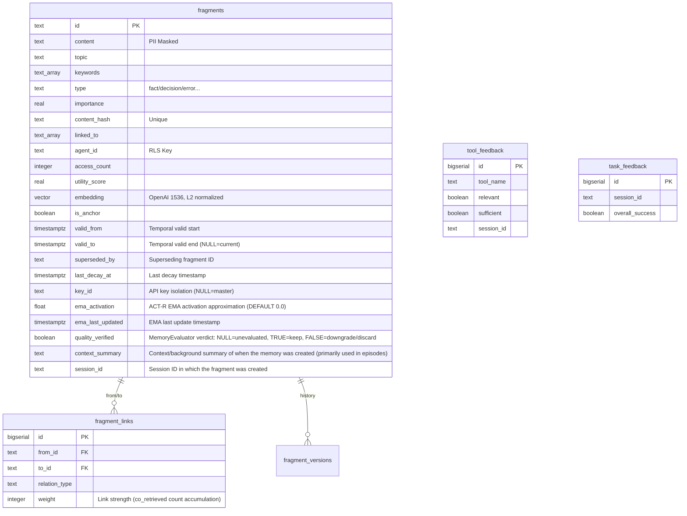

# Architecture

## System Architecture


```
server.js  (HTTP server)
    |
    +-- POST /mcp          Streamable HTTP -- JSON-RPC receiver
    +-- GET  /mcp          Streamable HTTP -- SSE stream
    +-- DELETE /mcp        Streamable HTTP -- Session termination
    +-- GET  /sse          Legacy SSE -- Session creation
    +-- POST /message      Legacy SSE -- JSON-RPC receiver
    +-- GET  /health       Health check
    +-- GET  /metrics      Prometheus metrics
    +-- GET  /authorize    OAuth 2.0 authorization endpoint
    +-- POST /token        OAuth 2.0 token endpoint
    +-- GET  /.well-known/oauth-authorization-server
    +-- GET  /.well-known/oauth-protected-resource
    |
    +-- lib/jsonrpc.js        JSON-RPC 2.0 parsing and method dispatch
    +-- lib/tool-registry.js  13 memory tool registration and routing
    |
    +-- lib/memory/
            +-- MemoryManager.js          Business logic facade (singleton)
            +-- FragmentFactory.js        Fragment creation, validation, PII masking
            +-- FragmentStore.js          PostgreSQL CRUD facade (delegates to FragmentReader + FragmentWriter)
            +-- FragmentReader.js         Fragment reads (getById, getByIds, getHistory, searchByKeywords, searchBySemantic)
            +-- FragmentWriter.js         Fragment writes (insert, update, delete, incrementAccess, touchLinked)
            +-- FragmentSearch.js         3-layer search orchestration (structural: L1->L2, semantic: L1->L2||L3 RRF merge)
            +-- FragmentIndex.js          Redis L1 index management, getFragmentIndex() singleton factory
            +-- EmbeddingWorker.js        Redis queue-based async embedding worker (EventEmitter)
            +-- GraphLinker.js            Embedding-ready event subscriber for auto-linking + retroactive linking + Hebbian co-retrieval linking
            +-- MemoryConsolidator.js     18-step maintenance pipeline (NLI + Gemini hybrid)
            +-- MemoryEvaluator.js        Async Gemini CLI quality evaluation worker (singleton)
            +-- NLIClassifier.js          NLI-based contradiction classifier (mDeBERTa ONNX, CPU)
            +-- SessionActivityTracker.js Per-session tool call/fragment activity tracking (Redis)
            +-- ConflictResolver.js       Conflict detection, supersede, autoLinkOnRemember (topic-based structural linking)
            +-- SessionLinker.js          Session fragment consolidation, auto-linking, cycle detection
            +-- LinkStore.js              Fragment link management (fragment_links CRUD + RCA chains)
            +-- FragmentGC.js             Fragment expiration/deletion, exponential decay, TTL tier transitions (permanent parole + EMA batch decay)
            +-- ConsolidatorGC.js         Feedback reports, stale fragment collection/cleanup, long fragment splitting, feedback-based correction
            +-- ContradictionDetector.js  Contradiction detection, supersede relation detection, pending queue processing
            +-- AutoReflect.js            Session-end auto reflect orchestrator
            +-- decay.js                  Exponential decay half-life constants, pure computation functions, ACT-R EMA activation approximation (`updateEmaActivation`, `computeEmaRankBoost`), EMA-based dynamic half-life (`computeDynamicHalfLife`), age-weighted utility score (`computeUtilityScore`)
            +-- SearchMetrics.js          L1/L2/L3/total layer-level latency collection (Redis circular buffer, P50/P90/P99)
            +-- SearchEventAnalyzer.js    Search event analysis, query pattern tracking (reads from SearchEventRecorder)
            +-- SearchEventRecorder.js    FragmentSearch.search() result to search_events table recording
            +-- EvaluationMetrics.js      tool_feedback-based implicit Precision@5 and downstream task success rate computation
            +-- MorphemeIndex.js          Morpheme-based L3 fallback index
            +-- memory-schema.sql         PostgreSQL schema definition
            +-- migration-001-temporal.sql Temporal schema migration (valid_from/to/superseded_by)
            +-- migration-002-decay.sql   Decay idempotency migration (last_decay_at)
            +-- migration-003-api-keys.sql API key management tables (api_keys, api_key_usage)
            +-- migration-004-key-isolation.sql fragments.key_id column (API key-based memory isolation)
            +-- migration-005-gc-columns.sql   GC policy hardening indexes (utility_score, access_count)
            +-- migration-006-superseded-by-constraint.sql fragment_links CHECK adds superseded_by
            +-- migration-007-link-weight.sql  fragment_links.weight column (link strength quantification)
            +-- migration-008-morpheme-dict.sql Morpheme dictionary table (morpheme_dict)
            +-- migration-009-co-retrieved.sql fragment_links CHECK adds co_retrieved (Hebbian linking)
            +-- migration-010-ema-activation.sql fragments.ema_activation/ema_last_updated columns
            +-- migration-011-key-groups.sql  API key group N:M mapping (api_key_groups, api_key_group_members)
            +-- migration-012-quality-verified.sql fragments.quality_verified column (MemoryEvaluator verdict persistence)
            +-- migration-013-search-events.sql search_events table (search query/result observability)
            +-- migration-014-ttl-short.sql        Short TTL tier support (ttl_short policy)
            +-- migration-015-created-at-index.sql Standalone created_at index (sort optimization)
            +-- migration-016-agent-topic-index.sql agent_id+topic composite index
            +-- migration-017-episodic.sql          episode type, context_summary, session_id columns
            +-- migration-018-fragment-quota.sql    api_keys.fragment_limit column (fragment quota)
            +-- migration-019-hnsw-tuning.sql       HNSW ef_construction 64→128
            +-- migration-020-search-layer-latency.sql search_events per-layer latency columns
```

Supporting modules:

```
lib/
+-- config.js          Environment variables exposed as constants
+-- auth.js            Bearer token validation
+-- oauth.js           OAuth 2.0 PKCE authorization/token handling
+-- sessions.js        Streamable/Legacy SSE session lifecycle
+-- redis.js           ioredis client (Sentinel support)
+-- gemini.js          Google Gemini API/CLI client (geminiCLIJson, isGeminiCLIAvailable)
+-- compression.js     Response compression (gzip/deflate)
+-- metrics.js         Prometheus metric collection (prom-client)
+-- logger.js          Winston logger (daily rotate)
+-- rate-limiter.js    IP-based sliding window rate limiter
+-- rbac.js            RBAC authorization (read/write/admin tool-level permissions)
+-- http-handlers.js   MCP/SSE HTTP handlers (Admin routes separated into admin-routes.js)
+-- scheduler.js       Periodic task scheduler (setInterval task management)
+-- scheduler-registry.js Scheduler task registry (per-task success/failure tracking)
+-- utils.js           Origin validation, JSON body parsing (2MB cap), SSE output

lib/admin/
+-- ApiKeyStore.js     API key CRUD, group CRUD, authentication verification (SHA-256 hash storage, raw key returned once only)
+-- admin-auth.js      Admin auth routes (POST /auth, session cookie issuance)
+-- admin-keys.js      API key management routes
+-- admin-memory.js    Memory operations routes (overview, fragments, anomalies, graph)
+-- admin-sessions.js  Session management routes
+-- admin-logs.js      Log viewing routes
+-- admin-export.js    Fragment export/import routes (export, import)

assets/admin/
+-- index.html         Admin SPA app shell (login form + container)
+-- admin.css          Admin UI stylesheet
+-- admin.js           Admin UI logic (7 navigation sections: overview, API keys, groups, memory ops, sessions, logs, knowledge graph)

lib/http/
+-- helpers.js         HTTP SSE stream helpers and request parsing utilities

lib/logging/
+-- audit.js           Audit logging and access history recording
```

Tool implementations are separated into `lib/tools/`.

```
lib/tools/
+-- memory.js    13 MCP tool handlers
+-- memory-schemas.js  Tool schema definitions (inputSchema)
+-- db.js        PostgreSQL connection pool, RLS-applied query helper (not exposed via MCP)
+-- db-tools.js  MCP DB tool handlers (per-tool logic split from db.js)
+-- embedding.js OpenAI text embedding generation
+-- stats.js     Access statistics collection and storage
+-- prompts.js   MCP Prompts definitions (analyze-session, retrieve-relevant-memory, etc.)
+-- resources.js MCP Resources definitions (memory://stats, memory://topics, etc.)
+-- index.js     Tool handler exports
```

One-time utility scripts are in `scripts/`.

```
scripts/
+-- backfill-embeddings.js                       Embedding backfill (one-time)
+-- normalize-vectors.js                         Vector L2 normalization (one-time)
+-- migrate.js                                   DB migration runner (schema_migrations-based incremental, .env auto-load, pgvector schema auto-detection)
+-- migration-007-flexible-embedding-dims.js     Embedding dimension migration
+-- cleanup-noise.js                             Bulk cleanup of low-quality/noise fragments (one-time)
```

`config/memory.js` is a separate configuration file for the memory system. It holds time-semantic composite ranking weights, stale thresholds, embedding worker settings, context injection, pagination, and GC policies.

---

## Database Schema

The schema name is `agent_memory`. Schema file: `lib/memory/memory-schema.sql`.



### fragments

The store for all fragments. This is the core table of the system.

| Column | Type | Constraint | Description |
|--------|------|------------|-------------|
| id | TEXT | PRIMARY KEY | Fragment unique identifier |
| content | TEXT | NOT NULL | Memory content body (300 characters recommended, atomic 1-3 sentences) |
| topic | TEXT | NOT NULL | Topic label (e.g., database, deployment, security) |
| keywords | TEXT[] | NOT NULL DEFAULT '{}' | Search keyword array (GIN indexed) |
| type | TEXT | NOT NULL, CHECK | fact / decision / error / preference / procedure / relation |
| importance | REAL | 0.0~1.0 CHECK | Importance. Defaults per type, decayed by MemoryConsolidator |
| content_hash | TEXT | UNIQUE | SHA hash-based duplicate prevention |
| source | TEXT | | Source identifier (session ID, tool name, etc.) |
| linked_to | TEXT[] | DEFAULT '{}' | Connected fragment ID list (GIN indexed) |
| agent_id | TEXT | NOT NULL DEFAULT 'default' | RLS isolation agent ID |
| access_count | INTEGER | DEFAULT 0 | Recall count -- factored into utility_score |
| accessed_at | TIMESTAMPTZ | | Last recall timestamp |
| created_at | TIMESTAMPTZ | DEFAULT NOW() | Creation timestamp |
| ttl_tier | TEXT | CHECK | hot / warm (default) / cold / permanent |
| estimated_tokens | INTEGER | DEFAULT 0 | cl100k_base token count -- used for tokenBudget calculation |
| utility_score | REAL | DEFAULT 1.0 | Usefulness score updated by MemoryEvaluator/MemoryConsolidator |
| verified_at | TIMESTAMPTZ | DEFAULT NOW() | Last quality verification timestamp |
| embedding | vector(1536) | | OpenAI text-embedding-3-small vector. L2-normalized (unit vector) before storage |
| is_anchor | BOOLEAN | DEFAULT FALSE | When true, exempt from decay, TTL demotion, and expiration deletion |
| valid_from | TIMESTAMPTZ | DEFAULT NOW() | Temporal validity start. Lower bound for `asOf` queries |
| valid_to | TIMESTAMPTZ | | Temporal validity end. NULL means currently valid |
| superseded_by | TEXT | | ID of the fragment that supersedes this one |
| last_decay_at | TIMESTAMPTZ | | Last decay application timestamp. When NULL, falls back to accessed_at/created_at |
| key_id | TEXT | FK -> api_keys.id, ON DELETE SET NULL | API key-based memory isolation. NULL means stored via master key (MEMENTO_ACCESS_KEY). When set, only that API key can query the fragment |
| ema_activation | FLOAT | DEFAULT 0.0 | ACT-R base-level activation EMA approximation. Updated on `incrementAccess()` via `alpha * (dt_sec)^{-0.5} + (1-alpha) * prev` (alpha=0.3). Not updated on L1 fallback path (noEma=true). Used as importance boost in `_computeRankScore()` |
| ema_last_updated | TIMESTAMPTZ | | EMA last update timestamp. Falls back to created_at when NULL |
| quality_verified | BOOLEAN | DEFAULT NULL | MemoryEvaluator quality verdict. NULL=unevaluated, TRUE=keep (verified), FALSE=downgrade/discard (rejected). Used in permanent promotion Circuit Breaker |
| context_summary | TEXT | | Context/background summary of when the memory was created (primarily used in episodes) |
| session_id | TEXT | | Session ID in which the fragment was created |

Index list: content_hash (UNIQUE), topic (B-tree), type (B-tree), keywords (GIN), importance DESC (B-tree), created_at DESC (B-tree), agent_id (B-tree), linked_to (GIN), (ttl_tier, created_at) (B-tree), source (B-tree), verified_at (B-tree), is_anchor WHERE TRUE (partial index), valid_from (B-tree), (topic, type) WHERE valid_to IS NULL (partial index), id WHERE valid_to IS NULL (partial UNIQUE).

The HNSW vector index is created as a conditional index on `embedding IS NOT NULL`. Parameters: m=16 (neighbor connections), ef_construction=128 (index build search depth), distance function vector_cosine_ops. ef_search=80 (applied via session-level SET LOCAL).

### fragment_links

A dedicated table for the relationship graph between fragments. Exists alongside the linked_to array in the fragments table.

| Column | Type | Description |
|--------|------|-------------|
| id | BIGSERIAL PK | Auto-increment identifier |
| from_id | TEXT | Source fragment (ON DELETE CASCADE) |
| to_id | TEXT | Target fragment (ON DELETE CASCADE) |
| relation_type | TEXT | related / caused_by / resolved_by / part_of / contradicts / superseded_by / co_retrieved |
| weight | INTEGER | Link strength. `co_retrieved` relations increment +1 on each co-recall. Default 1 |
| created_at | TIMESTAMPTZ | Relation creation timestamp |

A UNIQUE constraint on (from_id, to_id) prevents duplicate links; instead, weight is incremented.

`co_retrieved` links are created asynchronously by `GraphLinker.buildCoRetrievalLinks()` when a recall result returns 2 or more fragments. Following Hebbian associative learning, fragment pairs frequently retrieved together accumulate higher weights.

### tool_feedback

Tool usefulness feedback. Records whether recall returned results matching the intent and whether they were sufficient for task completion.

| Column | Type | Description |
|--------|------|-------------|
| id | BIGSERIAL PK | |
| tool_name | TEXT | Name of the evaluated tool |
| relevant | BOOLEAN | Was the result relevant to the request intent |
| sufficient | BOOLEAN | Was the result sufficient for task completion |
| suggestion | TEXT | Improvement suggestion (100 characters recommended) |
| context | TEXT | Usage context summary (50 characters recommended) |
| session_id | TEXT | Session identifier |
| trigger_type | TEXT | sampled (hook sampling) / voluntary (AI voluntary call) |
| created_at | TIMESTAMPTZ | |

### task_feedback

Per-session task effectiveness. Recorded via the reflect tool's task_effectiveness parameter.

| Column | Type | Description |
|--------|------|-------------|
| id | BIGSERIAL PK | |
| session_id | TEXT | Session identifier |
| overall_success | BOOLEAN | Whether the session's primary task completed successfully |
| tool_highlights | TEXT[] | Especially useful tools and reasons |
| tool_pain_points | TEXT[] | Tools needing improvement and reasons |
| created_at | TIMESTAMPTZ | |

### fragment_versions

Each time a fragment is modified via the amend tool, the previous version is preserved here. An audit trail of edit history.

| Column | Type | Description |
|--------|------|-------------|
| id | BIGSERIAL PK | |
| fragment_id | TEXT | Original fragment ID (ON DELETE CASCADE) |
| content | TEXT | Pre-edit content |
| topic | TEXT | Pre-edit topic |
| keywords | TEXT[] | Pre-edit keywords |
| type | TEXT | Pre-edit type |
| importance | REAL | Pre-edit importance |
| amended_at | TIMESTAMPTZ | Edit timestamp |
| amended_by | TEXT | Editing agent_id |

### Row-Level Security

RLS is enabled on the fragments table. The policy name is `fragment_isolation_policy`. It evaluates the session variable `app.current_agent_id`.

```sql
CREATE POLICY fragment_isolation_policy ON agent_memory.fragments
    USING (
        agent_id = current_setting('app.current_agent_id', true)
        OR agent_id = 'default'
        OR current_setting('app.current_agent_id', true) IN ('system', 'admin')
    );
```

Access is granted only to fragments matching the agent ID, `default` agent fragments (shared data), and `system`/`admin` sessions (for maintenance). Tool handlers set the context via `SET LOCAL app.current_agent_id = $1` immediately before query execution.

### API Key-Based Memory Isolation

The `key_id` column provides an additional isolation layer at the API key level. Fragments stored via the master key (`MEMENTO_ACCESS_KEY`) have `key_id = NULL` and are queryable only by the master key. Fragments stored via a DB-issued API key have `key_id = <that key's ID>` and are queryable only by that key.

This isolation model implements per-key memory partitioning in multi-agent environments. API keys are managed through the Admin SPA (`/v1/internal/model/nothing`). On creation, the raw key (`mmcp_<slug>_<32 hex>`) is returned in the response exactly once; only the SHA-256 hash is stored in the database.

The Admin UI (`/v1/internal/model/nothing`) requires master key authentication. Authenticate via the Authorization Bearer header. A successful POST /auth issues an HttpOnly session cookie that is automatically attached to subsequent requests.

### Admin Console Structure

The Admin UI is built as an app shell architecture (`assets/admin/index.html` + `assets/admin/admin.css` + `assets/admin/admin.js`). It is divided into 7 navigation sections:

| Section | Description | Status |
|---------|-------------|--------|
| Overview | KPI cards, system health, search layer analysis, recent activity | Implemented |
| API Keys | Key list/creation/management, status changes, usage tracking | Implemented |
| Groups | Key group management, member assignment | Implemented |
| Memory Ops | Fragment search/filter, anomaly detection, search observability | Implemented |
| Sessions | Session list, detail view, activity tracking, manual reflect, terminate, expired cleanup, bulk unreflected reflect | Implemented |
| Logs | Log file listing, content viewing (reverse tail), level/search filters, statistics | Implemented |
| Knowledge Graph | Fragment relationship visualization (D3.js force-directed), topic filter, node detail | Implemented |

See [Admin Console Guide](admin-console-guide.md) for screen layouts and operation details for each tab.

The `/stats` response includes `searchMetrics`, `observability`, `queues`, and `healthFlags` fields in addition to basic statistics.

### API Key Groups

API keys in the same group share an identical fragment isolation scope. Use this when multiple agents (Claude Code, Codex, Gemini, etc.) need to share a single project's memory.

- N:M mapping: A key can belong to multiple groups (`api_key_group_members` table)
- Isolation granularity: `COALESCE(group_id, api_keys.id)` is used as the effective_key_id during authentication
- Keys without a group: Existing behavior preserved (isolated by their own id)

Admin REST endpoints:

| Method | Path | Description |
|--------|------|-------------|
| GET | `.../groups` | Group list (includes key_count) |
| POST | `.../groups` | Create group (`{ name, description? }`) |
| DELETE | `.../groups/:id` | Delete group (membership CASCADE) |
| GET | `.../groups/:id/members` | List keys in a group |
| POST | `.../groups/:id/members` | Add a key to a group (`{ key_id }`) |
| DELETE | `.../groups/:gid/members/:kid` | Remove a key from a group |
| GET | `.../memory/overview` | Memory overview (type/topic distribution, quality unverified, superseded, recent activity) |
| GET | `.../memory/search-events?days=N` | Search event analysis (total searches, failed queries, feedback stats) |
| GET | `.../memory/fragments?topic=&type=&key_id=&page=&limit=` | Fragment search/filter (paginated) |
| GET | `.../memory/anomalies` | Anomaly detection results |
| GET | `.../sessions` | Session list (activity enrichment, unreflected session count) |
| GET | `.../sessions/:id` | Session detail (search events, tool feedback) |
| POST | `.../sessions/:id/reflect` | Manual reflect execution |
| DELETE | `.../sessions/:id` | Terminate session |
| POST | `.../sessions/cleanup` | Expired session cleanup |
| POST | `.../sessions/reflect-all` | Bulk reflect for unreflected sessions |
| GET | `.../logs/files` | Log file list (with sizes) |
| GET | `.../logs/read?file=&tail=&level=&search=` | Log content viewing (reverse tail, level/search filters) |
| GET | `.../logs/stats` | Log statistics (per-level counts, recent errors, disk usage) |
| GET | `.../assets/*` | Admin static files (admin.css, admin.js). No authentication required |

---

## 3-Layer Search

The recall tool searches from the least expensive layer first. If an earlier layer yields sufficient results, later layers are skipped.


**L1: Redis Set intersection.** When a fragment is stored, FragmentIndex uses each keyword as a Redis Set key, storing the fragment ID. The Set `keywords:database` contains the IDs of all fragments with "database" as a keyword. Multi-keyword search is a SINTER operation across multiple Sets. Intersection time complexity is O(N*K), where N is the smallest Set's size and K is the keyword count. Since Redis processes this in-memory, it completes within milliseconds. L1 results are merged with L2 results in subsequent stages.

**L2: PostgreSQL GIN index.** Always executed after L1. A GIN (Generalized Inverted Index) is on the keywords TEXT[] column. Search uses the `keywords && ARRAY[...]` operator -- an operator that checks for array intersection. The GIN index indexes each array element individually, so this operation is processed as an index scan, not a sequential scan.

**L3: pgvector HNSW cosine similarity.** Triggered only when the recall parameters include a `text` field. Insufficient result count alone does not activate L3. The query text is converted to an embedding vector, and `embedding <=> $1` computes cosine distance. All embeddings are L2-normalized unit vectors, so cosine similarity and inner product are equivalent. HNSW indexes quickly find approximate nearest neighbors. The `threshold` parameter sets a similarity floor -- L3 results below this value are excluded. L1/L2-routed results lack a similarity value and are therefore exempt from threshold filtering.

All layer results pass through a `valid_to IS NULL` filter in the final stage -- fragments superseded via superseded_by are excluded from search by default. Passing `includeSuperseded: true` includes expired fragments.

Redis and embedding APIs are optional. Without them, the corresponding layers simply do not operate. PostgreSQL alone provides fully functional L2 search and core features.

**RRF hybrid merge.** When the `text` parameter is present, L2 and L3 run in parallel via `Promise.all`. Results are merged using Reciprocal Rank Fusion (RRF): `score(f) = sum w/(k + rank + 1)`, default k=60. L1 results are injected with highest priority by multiplying l1WeightFactor (default 2.0). Fragments that exist only in L1 and lack a content field (content not loaded) are excluded from final results. When only keywords/topic/type are used without the `text` parameter, the response contains only L1+L2 results without L3.

After the three layers' results are merged via RRF, time-semantic composite ranking is applied. Composite score formula: `score = effectiveImportance * 0.4 + temporalProximity * 0.3 + similarity * 0.3`. effectiveImportance is `importance + computeEmaRankBoost(ema_activation) * 0.5` -- fragments with higher ACT-R EMA activation (frequently recalled) receive additional ranking boost. `computeEmaRankBoost(ema) = 0.2 * (1 - e^{-ema})` with a maximum boost of 0.10. The cap was reduced from 0.3 to 0.2 because: an importance=0.65 fragment's effectiveImportance maxes at 0.65+0.10*0.5=0.70, falling short of the permanent promotion threshold (importance>=0.8) and preventing garbage fragments from cycling upward. temporalProximity is calculated via exponential decay from anchorTime (default: current time) -- `Math.pow(2, -distDays / 30)`. When anchorTime is set to a past moment, fragments closer to that point score higher. The `asOf` parameter is automatically converted to anchorTime and processed through the normal recall path. Final return volume is controlled by the `tokenBudget` parameter. The js-tiktoken cl100k_base encoder precisely calculates tokens per fragment, trimming when the budget is exceeded. Default token budget is 1000. Results can be paginated with `pageSize` and `cursor` parameters.

When `includeLinks: true` (default) is set on recall, linked fragments are fetched via a 1-hop traversal. The `linkRelationType` parameter filters for specific relation types -- when unspecified, caused_by, resolved_by, and related are included. The linked fragment fetch limit is `MEMORY_CONFIG.linkedFragmentLimit` (default 10).

> **Note:** The L1 Redis index currently supports namespace isolation by API key (keyId) only. Agent-level isolation is enforced at L2/L3, so final result accuracy is unaffected. In multi-agent deployments, L1 candidate sets may include fragments from other agents.

---

## TTL Tiers

Fragments move across four tiers -- hot, warm, cold, permanent -- based on access frequency. MemoryConsolidator periodically handles demotion/promotion. Re-accessed fragments are restored to hot.


| Tier | Description |
|------|-------------|
| hot | Recently created or frequently accessed fragments |
| warm | Default tier. Most long-term memories reside here |
| cold | Fragments not accessed for a long time. Candidates for deletion in the next maintenance cycle |
| permanent | Exempt from decay, TTL demotion, and expiration deletion |

Fragments stored with `scope: "session"` serve as session working memory. They are discarded when the session ends. `scope: "permanent"` is the default.

Fragments marked `isAnchor: true` are permanently excluded from MemoryConsolidator's decay and deletion regardless of their tier. Even with importance as low as 0.1, they will not be deleted. Use this for knowledge that must never be lost.

Stale thresholds (days): procedure=30, fact=60, decision=90, default=60. Adjust in `config/memory.js` under `MEMORY_CONFIG.staleThresholds`.
