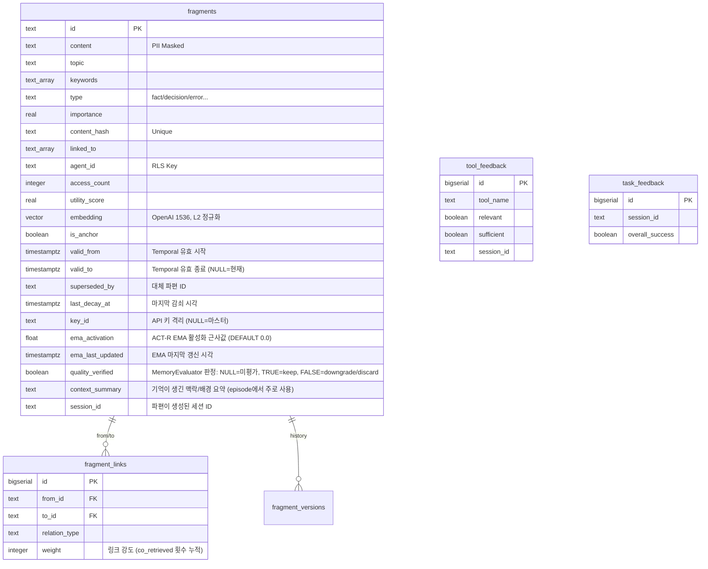

# Architecture

## 시스템 구조


```
server.js  (HTTP 서버)
    │
    ├── POST /mcp          Streamable HTTP — JSON-RPC 수신
    ├── GET  /mcp          Streamable HTTP — SSE 스트림
    ├── DELETE /mcp        Streamable HTTP — 세션 종료
    ├── GET  /sse          Legacy SSE — 세션 생성
    ├── POST /message      Legacy SSE — JSON-RPC 수신
    ├── GET  /health       헬스 체크
    ├── GET  /metrics      Prometheus 메트릭
    ├── GET  /authorize    OAuth 2.0 인가 엔드포인트
    ├── POST /token        OAuth 2.0 토큰 엔드포인트
    ├── GET  /.well-known/oauth-authorization-server
    └── GET  /.well-known/oauth-protected-resource
    │
    ├── lib/jsonrpc.js        JSON-RPC 2.0 파싱 및 메서드 디스패치
    ├── lib/tool-registry.js  13개 기억 도구 등록 및 라우팅
    │
    └── lib/memory/
            ├── MemoryManager.js          비즈니스 로직 파사드 (싱글턴)
            ├── FragmentFactory.js        파편 생성, 유효성 검증, PII 마스킹
            ├── FragmentStore.js          PostgreSQL CRUD 파사드 (FragmentReader + FragmentWriter 위임)
            ├── FragmentReader.js         파편 읽기 (getById, getByIds, getHistory, searchByKeywords, searchBySemantic)
            ├── FragmentWriter.js         파편 쓰기 (insert, update, delete, incrementAccess, touchLinked)
            ├── FragmentSearch.js         3계층 검색 조율 (구조적: L1→L2, 시맨틱: L1→L2‖L3 RRF 병합)
            ├── FragmentIndex.js          Redis L1 인덱스 관리, getFragmentIndex() 싱글톤 팩토리
            ├── EmbeddingWorker.js        Redis 큐 기반 비동기 임베딩 생성 워커 (EventEmitter)
            ├── GraphLinker.js            임베딩 완료 이벤트 구독 자동 관계 생성 + 소급 링킹 + Hebbian co-retrieval 링킹
            ├── MemoryConsolidator.js     18단계 유지보수 파이프라인 (NLI + Gemini 하이브리드)
            ├── MemoryEvaluator.js        비동기 Gemini CLI 품질 평가 워커 (싱글턴)
            ├── NLIClassifier.js          NLI 기반 모순 분류기 (mDeBERTa ONNX, CPU)
            ├── SessionActivityTracker.js 세션별 도구 호출/파편 활동 추적 (Redis)
            ├── ConflictResolver.js       충돌 감지, supersede, autoLinkOnRemember(topic 기반 구조적 링킹)
            ├── SessionLinker.js         세션 파편 통합, 자동 링크, 사이클 감지
            ├── LinkStore.js             파편 링크 관리 (fragment_links CRUD + RCA 체인)
            ├── FragmentGC.js            파편 만료 삭제, 지수 감쇠, TTL 계층 전환 (permanent parole + EMA 배치 감쇠 포함)
            ├── ConsolidatorGC.js        피드백 리포트, stale 파편 수집/정리, 긴 파편 분할, 피드백 기반 보정
            ├── ContradictionDetector.js 모순 감지, 대체 관계 감지, 보류 큐 처리
            ├── AutoReflect.js            세션 종료 시 자동 reflect 오케스트레이터
            ├── decay.js                  지수 감쇠 반감기 상수, 순수 계산 함수, ACT-R EMA 활성화 근사 (`updateEmaActivation`, `computeEmaRankBoost`), EMA 기반 동적 반감기 (`computeDynamicHalfLife`), 나이 가중치 utility score (`computeUtilityScore`)
            ├── SearchMetrics.js          L1/L2/L3/total 레이어별 지연 시간 수집 (Redis 원형 버퍼, P50/P90/P99)
            ├── SearchEventAnalyzer.js    검색 이벤트 분석, 쿼리 패턴 추적 (SearchEventRecorder로부터 읽음)
            ├── SearchEventRecorder.js    FragmentSearch.search() 결과 to search_events 테이블 기록
            ├── UtilityBaseline.js        파편 utility baseline 계산 (중복 제거/압축 판단 기준선)
            ├── LinkedFragmentLoader.js   연결 파편 일괄 로드 (1-hop 이웃 배치 조회)
            ├── GraphNeighborSearch.js    L2.5 그래프 이웃 검색 (fragment_links 1-hop, RRF 1.5x 가중)
            ├── EvaluationMetrics.js      tool_feedback 기반 implicit Precision@5 및 downstream task 성공률 계산
            ├── MorphemeIndex.js          형태소 기반 L3 폴백 인덱스
            ├── memory-schema.sql         PostgreSQL 스키마 정의
            ├── migration-001-temporal.sql Temporal 스키마 마이그레이션 (valid_from/to/superseded_by)
            ├── migration-002-decay.sql   감쇠 멱등성 마이그레이션 (last_decay_at)
            ├── migration-003-api-keys.sql API 키 관리 테이블 (api_keys, api_key_usage)
            ├── migration-004-key-isolation.sql fragments.key_id 컬럼 추가 (API 키 기반 기억 격리)
            ├── migration-005-gc-columns.sql   GC 정책 강화 인덱스 (utility_score, access_count)
            ├── migration-006-superseded-by-constraint.sql fragment_links CHECK에 superseded_by 추가
            ├── migration-007-link-weight.sql  fragment_links.weight 컬럼 추가 (링크 강도 수치화)
            ├── migration-008-morpheme-dict.sql 형태소 사전 테이블 (morpheme_dict)
            ├── migration-009-co-retrieved.sql fragment_links CHECK에 co_retrieved 추가 (Hebbian 링킹)
            ├── migration-010-ema-activation.sql fragments.ema_activation/ema_last_updated 컬럼 추가
            ├── migration-011-key-groups.sql  API 키 그룹 N:M 매핑 (api_key_groups, api_key_group_members)
            ├── migration-012-quality-verified.sql fragments.quality_verified 컬럼 추가 (MemoryEvaluator 판정 결과 영속화)
            ├── migration-013-search-events.sql search_events 테이블 생성 (검색 쿼리/결과 관측성)
            ├── migration-014-ttl-short.sql        단기 TTL 계층 지원 (ttl_short 정책)
            ├── migration-015-created-at-index.sql created_at 단독 인덱스 추가 (정렬 최적화)
            ├── migration-016-agent-topic-index.sql agent_id+topic 복합 인덱스
            ├── migration-017-episodic.sql         episode 유형, context_summary, session_id 컬럼
            ├── migration-018-fragment-quota.sql   api_keys.fragment_limit 컬럼 (파편 할당량)
            ├── migration-019-hnsw-tuning.sql      HNSW ef_construction 64→128
            └── migration-020-search-layer-latency.sql search_events 레이어별 레이턴시 컬럼
```

지원 모듈:

```
lib/
├── config.js          환경변수를 상수로 노출
├── auth.js            Bearer 토큰 검증
├── oauth.js           OAuth 2.0 PKCE 인가/토큰 처리
├── sessions.js        Streamable/Legacy SSE 세션 생명주기
├── redis.js           ioredis 클라이언트 (Sentinel 지원)
├── gemini.js          Google Gemini API/CLI 클라이언트 (geminiCLIJson, isGeminiCLIAvailable)
├── compression.js     응답 압축 (gzip/deflate)
├── metrics.js         Prometheus 메트릭 수집 (prom-client)
├── logger.js          Winston 로거 (daily rotate)
├── rate-limiter.js    IP 기반 sliding window rate limiter
├── rbac.js            RBAC 권한 검사 (read/write/admin 도구 레벨 권한 적용)
├── http-handlers.js   MCP/SSE HTTP 핸들러 (Admin 라우트는 admin-routes.js로 분리)
├── scheduler.js       주기 작업 스케줄러 (setInterval 작업 관리)
├── scheduler-registry.js 스케줄러 작업 레지스트리 (작업별 성공/실패 추적)
└── utils.js           Origin 검증, JSON 바디 파싱(2MB 상한), SSE 출력

lib/admin/
├── ApiKeyStore.js     API 키 CRUD, 그룹 CRUD, 인증 검증 (SHA-256 해시 저장, 원시 키 단 1회 반환)
├── admin-auth.js      Admin 인증 라우트 (POST /auth, 세션 쿠키 발급)
├── admin-keys.js      API 키 관리 라우트
├── admin-memory.js    메모리 운영 라우트 (overview, fragments, anomalies, graph)
├── admin-sessions.js  세션 관리 라우트
├── admin-logs.js      로그 조회 라우트
└── admin-export.js    파편 내보내기/가져오기 라우트 (export, import)

assets/admin/
├── index.html         Admin SPA app shell (로그인 폼 + 컨테이너)
├── admin.css          Admin UI 스타일시트
└── admin.js           Admin UI 로직 (7개 내비게이션: 개요, API 키, 그룹, 메모리 운영, 세션, 로그, 지식 그래프)

lib/http/
└── helpers.js         HTTP SSE 스트림 헬퍼 및 요청 파싱 유틸리티

lib/logging/
└── audit.js           감사 로그 및 접근 이력 기록
```

도구 구현은 `lib/tools/`에 분리되어 있다.

```
lib/tools/
├── memory.js    13개 MCP 도구 핸들러
├── memory-schemas.js  도구 스키마 정의 (inputSchema)
├── db.js        PostgreSQL 연결 풀, RLS 적용 쿼리 헬퍼 (MCP 미노출)
├── db-tools.js  MCP DB 도구 핸들러 (db.js에서 분리된 도구별 로직)
├── embedding.js OpenAI 텍스트 임베딩 생성
├── stats.js     접근 통계 수집 및 저장
├── prompts.js   MCP Prompts 정의 (analyze-session, retrieve-relevant-memory 등)
├── resources.js MCP Resources 정의 (memory://stats, memory://topics 등)
└── index.js     도구 핸들러 export
```

CLI 진입점과 서브커맨드는 `bin/` 및 `lib/cli/`에 분리되어 있다.

```
bin/
└── memento.js          CLI 진입점

lib/cli/
├── parseArgs.js        인자 파서
├── serve.js            서버 시작
├── migrate.js          마이그레이션
├── cleanup.js          노이즈 정리
├── backfill.js         임베딩 백필
├── stats.js            통계 조회
├── health.js           연결 진단
├── recall.js           터미널 recall
├── remember.js         터미널 remember
└── inspect.js          파편 상세
```

1회성 유틸리티 스크립트는 `scripts/`에 분리되어 있다.

```
scripts/
├── backfill-embeddings.js                       임베딩 소급 처리 (1회성)
├── normalize-vectors.js                         벡터 L2 정규화 (1회성)
├── migrate.js                                   DB 마이그레이션 러너 (schema_migrations 기반 증분 적용, .env 자동 로드, pgvector 스키마 자동 감지)
├── migration-007-flexible-embedding-dims.js     임베딩 차원 마이그레이션
└── cleanup-noise.js                             저품질/노이즈 파편 일괄 정리 (1회성)
```

`config/memory.js`는 별도 파일로 분리된 기억 시스템 설정이다. 시간-의미 복합 랭킹 가중치, stale 임계값, 임베딩 워커, 컨텍스트 주입, 페이지네이션, GC 정책을 담는다.

---

## 데이터베이스 스키마

스키마명은 `agent_memory`다. 스키마 파일: `lib/memory/memory-schema.sql`.



### fragments

모든 파편의 저장소. 시스템의 핵심 테이블이다.

| 컬럼 | 타입 | 제약 | 설명 |
|------|------|------|------|
| id | TEXT | PRIMARY KEY | 파편 고유 식별자 |
| content | TEXT | NOT NULL | 기억 내용 본문 (300자 권장, 원자적 1~3문장) |
| topic | TEXT | NOT NULL | 주제 레이블 (예: database, deployment, security) |
| keywords | TEXT[] | NOT NULL DEFAULT '{}' | 검색용 키워드 배열 (GIN 인덱스) |
| type | TEXT | NOT NULL, CHECK | fact / decision / error / preference / procedure / relation |
| importance | REAL | 0.0~1.0 CHECK | 중요도. type별 기본값, MemoryConsolidator에 의해 감쇠 |
| content_hash | TEXT | UNIQUE | SHA 해시 기반 중복 방지 |
| source | TEXT | | 출처 식별자 (세션 ID, 도구명 등) |
| linked_to | TEXT[] | DEFAULT '{}' | 연결 파편 ID 목록 (GIN 인덱스) |
| agent_id | TEXT | NOT NULL DEFAULT 'default' | RLS 격리 기준 에이전트 ID |
| access_count | INTEGER | DEFAULT 0 | 회상 횟수 — utility_score 산정에 반영 |
| accessed_at | TIMESTAMPTZ | | 최근 회상 시각 |
| created_at | TIMESTAMPTZ | DEFAULT NOW() | 생성 시각 |
| ttl_tier | TEXT | CHECK | hot / warm(기본) / cold / permanent |
| estimated_tokens | INTEGER | DEFAULT 0 | cl100k_base 토큰 수 — tokenBudget 계산에 사용 |
| utility_score | REAL | DEFAULT 1.0 | MemoryEvaluator/MemoryConsolidator가 갱신하는 유용성 점수 |
| verified_at | TIMESTAMPTZ | DEFAULT NOW() | 마지막 품질 검증 시각 |
| embedding | vector(1536) | | OpenAI text-embedding-3-small 벡터. 저장 전 L2 정규화(단위 벡터) 적용 |
| is_anchor | BOOLEAN | DEFAULT FALSE | true 시 감쇠, TTL 강등, 만료 삭제 전부 면제 |
| valid_from | TIMESTAMPTZ | DEFAULT NOW() | Temporal 유효 구간 시작. `asOf` 쿼리의 하한 |
| valid_to | TIMESTAMPTZ | | Temporal 유효 구간 종료. NULL이면 현재 유효 파편 |
| superseded_by | TEXT | | 이 파편을 대체한 파편의 ID |
| last_decay_at | TIMESTAMPTZ | | 마지막 감쇠 적용 시각. NULL이면 accessed_at/created_at 기준으로 보정 |
| key_id | TEXT | FK → api_keys.id, ON DELETE SET NULL | API 키 기반 기억 격리. NULL이면 마스터 키(MEMENTO_ACCESS_KEY)로 저장된 기억. 값이 있으면 해당 API 키로만 조회 가능 |
| ema_activation | FLOAT | DEFAULT 0.0 | ACT-R 기저 활성화 EMA 근사값. `incrementAccess()` 호출 시 `α * (Δt_sec)^{-0.5} + (1-α) * prev` 수식으로 갱신(α=0.3). L1 fallback 경로에서는 갱신되지 않음(noEma=true). `_computeRankScore()`에서 importance 부스트로 활용 |
| ema_last_updated | TIMESTAMPTZ | | EMA 마지막 갱신 시각. NULL이면 created_at 기준으로 보정 |
| quality_verified | BOOLEAN | DEFAULT NULL | MemoryEvaluator 품질 판정 결과. NULL=미평가, TRUE=keep(검증됨), FALSE=downgrade/discard(부정). permanent 승격 Circuit Breaker에 사용됨 |
| context_summary | TEXT | | 기억이 생긴 맥락/배경 요약 (episode에서 주로 사용) |
| session_id | TEXT | | 파편이 생성된 세션 ID |

인덱스 목록: content_hash(UNIQUE), topic(B-tree), type(B-tree), keywords(GIN), importance DESC(B-tree), created_at DESC(B-tree), agent_id(B-tree), linked_to(GIN), (ttl_tier, created_at)(B-tree), source(B-tree), verified_at(B-tree), is_anchor WHERE TRUE(부분 인덱스), valid_from(B-tree), (topic, type) WHERE valid_to IS NULL(부분 인덱스), id WHERE valid_to IS NULL(부분 UNIQUE).

HNSW 벡터 인덱스는 `embedding IS NOT NULL` 조건부 인덱스로 생성된다. 파라미터: m=16(이웃 연결 수), ef_construction=128(인덱스 구축 탐색 깊이), 거리 함수 vector_cosine_ops. ef_search=80 (세션 레벨 SET LOCAL 적용).

### fragment_links

파편 간 관계망을 전담하는 별도 테이블. fragments 테이블의 linked_to 배열과 병행하여 존재한다.

| 컬럼 | 타입 | 설명 |
|------|------|------|
| id | BIGSERIAL PK | 자동 증가 식별자 |
| from_id | TEXT | 출발 파편 (ON DELETE CASCADE) |
| to_id | TEXT | 도착 파편 (ON DELETE CASCADE) |
| relation_type | TEXT | related / caused_by / resolved_by / part_of / contradicts / superseded_by / co_retrieved |
| weight | INTEGER | 링크 강도. `co_retrieved` 관계는 공동 회상 시마다 +1 누적. 기본값 1 |
| created_at | TIMESTAMPTZ | 관계 생성 시각 |

(from_id, to_id) 조합에 UNIQUE 제약이 걸려 있다. 중복 링크는 저장되지 않고 weight가 증가한다.

`co_retrieved` 링크는 recall 결과에 2개 이상 파편이 반환될 때 `GraphLinker.buildCoRetrievalLinks()`가 비동기로 생성한다. Hebbian 연관 학습 원리에 따라 자주 함께 검색되는 파편 쌍의 weight가 높아진다.

### tool_feedback

도구 유용성 피드백. recall이 의도에 맞는 결과를 반환했는지, 작업 완료에 충분했는지를 기록한다.

| 컬럼 | 타입 | 설명 |
|------|------|------|
| id | BIGSERIAL PK | |
| tool_name | TEXT | 평가 대상 도구명 |
| relevant | BOOLEAN | 결과가 요청 의도와 관련 있었는가 |
| sufficient | BOOLEAN | 결과가 작업 완료에 충분했는가 |
| suggestion | TEXT | 개선 제안 (100자 이내 권장) |
| context | TEXT | 사용 맥락 요약 (50자 이내 권장) |
| session_id | TEXT | 세션 식별자 |
| trigger_type | TEXT | sampled(훅 샘플링) / voluntary(AI 자발적 호출) |
| created_at | TIMESTAMPTZ | |

### task_feedback

세션 단위 작업 효과성. reflect 도구의 task_effectiveness 파라미터로 기록된다.

| 컬럼 | 타입 | 설명 |
|------|------|------|
| id | BIGSERIAL PK | |
| session_id | TEXT | 세션 식별자 |
| overall_success | BOOLEAN | 세션의 주요 작업이 성공적으로 완료되었는가 |
| tool_highlights | TEXT[] | 특히 유용했던 도구와 이유 목록 |
| tool_pain_points | TEXT[] | 불편하거나 개선이 필요한 도구와 이유 목록 |
| created_at | TIMESTAMPTZ | |

### fragment_versions

amend 도구로 파편을 수정할 때마다 이전 버전이 여기에 보존된다. 수정 이력의 감사 추적(audit trail).

| 컬럼 | 타입 | 설명 |
|------|------|------|
| id | BIGSERIAL PK | |
| fragment_id | TEXT | 원본 파편 ID (ON DELETE CASCADE) |
| content | TEXT | 수정 전 내용 |
| topic | TEXT | 수정 전 주제 |
| keywords | TEXT[] | 수정 전 키워드 |
| type | TEXT | 수정 전 유형 |
| importance | REAL | 수정 전 중요도 |
| amended_at | TIMESTAMPTZ | 수정 시각 |
| amended_by | TEXT | 수정한 agent_id |

### Row-Level Security

fragments 테이블에 RLS가 활성화되어 있다. 정책명은 `fragment_isolation_policy`. 판단 기준은 세션 변수 `app.current_agent_id`다.

```sql
CREATE POLICY fragment_isolation_policy ON agent_memory.fragments
    USING (
        agent_id = current_setting('app.current_agent_id', true)
        OR agent_id = 'default'
        OR current_setting('app.current_agent_id', true) IN ('system', 'admin')
    );
```

에이전트 ID가 일치하는 파편, `default` 에이전트의 파편(공용 데이터), `system`/`admin` 세션(유지보수용)에만 접근이 허용된다. 도구 핸들러는 쿼리 실행 직전 `SET LOCAL app.current_agent_id = $1`로 컨텍스트를 설정한다.

### API 키 기반 기억 격리

`key_id` 컬럼을 통해 API 키 단위의 추가 격리 레이어를 지원한다. 마스터 키(`MEMENTO_ACCESS_KEY`)로 접속한 요청이 저장한 파편은 `key_id = NULL`이며 마스터 키로만 조회 가능하다. DB에 발급된 API 키로 접속한 요청이 저장한 파편은 `key_id = <해당 키 ID>`로 기록되며 그 키만 조회할 수 있다.

이 격리 모델은 다중 에이전트 환경에서 키 단위 메모리 파티셔닝을 구현한다. API 키는 Admin SPA(`/v1/internal/model/nothing`)에서 관리하며, 생성 시 원시 키(`mmcp_<slug>_<32 hex>`)는 응답에서 단 1회만 반환되고 DB에는 SHA-256 해시만 저장된다.

Admin UI(`/v1/internal/model/nothing`)는 마스터 키 인증이 필요하다. Authorization Bearer 헤더로 인증한다. POST /auth 성공 시 HttpOnly 세션 쿠키가 발급되어 이후 요청에 자동 첨부된다.

### Admin 콘솔 구조

Admin UI는 app shell 아키텍처로 구성된다 (`assets/admin/index.html` + `assets/admin/admin.css` + `assets/admin/admin.js`). 7개 내비게이션 영역으로 나뉜다:

| 영역 | 설명 | 상태 |
|------|------|------|
| 개요 | KPI 카드, 시스템 헬스, 검색 레이어 분석, 최근 활동 | 구현 완료 |
| API 키 | 키 목록/생성/관리, 상태 변경, 사용량 추적 | 구현 완료 |
| 그룹 | 키 그룹 관리, 멤버 할당 | 구현 완료 |
| 메모리 운영 | 파편 검색/필터, 이상 탐지, 검색 관측성 | 구현 완료 |
| 세션 | 세션 목록, 상세 조회, 활동 추적, 수동 reflect, 종료, 만료 정리, 미반영 일괄 reflect | 구현 완료 |
| 로그 | 로그 파일 목록, 내용 조회(역순 tail), 레벨/검색 필터, 통계 | 구현 완료 |
| 지식 그래프 | 파편 관계 시각화 (D3.js force-directed), 토픽 필터, 노드 상세 | 구현 완료 |

각 탭의 화면 구성과 조작 방법은 [관리자 콘솔 사용 안내](admin-console-guide.md)를 참고한다.

`/stats` 응답에는 기본 통계 외에 `searchMetrics`, `observability`, `queues`, `healthFlags` 필드가 추가되었다.

### API 키 그룹

같은 그룹에 속한 API 키들은 동일한 파편 격리 범위를 공유한다. 여러 에이전트(Claude Code, Codex, Gemini 등)가 하나의 프로젝트 기억을 공유할 때 사용한다.

- N:M 매핑: 한 키가 복수 그룹에 소속 가능 (`api_key_group_members` 테이블)
- 격리 해상도: 인증 시 `COALESCE(group_id, api_keys.id)`를 effective_key_id로 사용
- 그룹 미소속 키: 기존 동작 유지 (자체 id로 격리)

Admin REST 엔드포인트:

| Method | Path | 설명 |
|--------|------|------|
| GET | `.../groups` | 그룹 목록 (key_count 포함) |
| POST | `.../groups` | 그룹 생성 (`{ name, description? }`) |
| DELETE | `.../groups/:id` | 그룹 삭제 (멤버십 CASCADE) |
| GET | `.../groups/:id/members` | 그룹 소속 키 목록 |
| POST | `.../groups/:id/members` | 키를 그룹에 추가 (`{ key_id }`) |
| DELETE | `.../groups/:gid/members/:kid` | 키를 그룹에서 제거 |
| GET | `.../memory/overview` | 메모리 전체 현황 (유형/토픽 분포, 품질 미검증, superseded, 최근 활동) |
| GET | `.../memory/search-events?days=N` | 검색 이벤트 분석 (총 검색 수, 실패 쿼리, 피드백 통계) |
| GET | `.../memory/fragments?topic=&type=&key_id=&page=&limit=` | 파편 검색/필터링 (페이지네이션) |
| GET | `.../memory/anomalies` | 이상 탐지 결과 조회 |
| GET | `.../sessions` | 세션 목록 (활동 enrichment, 미반영 세션 수 포함) |
| GET | `.../sessions/:id` | 세션 상세 (검색 이벤트, 도구 피드백 포함) |
| POST | `.../sessions/:id/reflect` | 수동 reflect 실행 |
| DELETE | `.../sessions/:id` | 세션 종료 |
| POST | `.../sessions/cleanup` | 만료 세션 정리 |
| POST | `.../sessions/reflect-all` | 미반영 세션 일괄 reflect |
| GET | `.../logs/files` | 로그 파일 목록 (크기 포함) |
| GET | `.../logs/read?file=&tail=&level=&search=` | 로그 내용 조회 (역순 tail, 레벨/검색 필터) |
| GET | `.../logs/stats` | 로그 통계 (레벨별 카운트, 최근 에러, 디스크 사용량) |
| GET | `.../assets/*` | Admin 정적 파일 서빙 (admin.css, admin.js). 인증 불필요 |

---

## 3계층 검색

recall 도구는 비용이 낮은 계층부터 순서대로 검색한다. 앞 계층에서 충분한 결과가 나오면 뒤 계층은 실행하지 않는다.


**L1: Redis Set 교집합.** 파편이 저장될 때마다 FragmentIndex가 각 키워드를 Redis Set의 키로 사용하여 파편 ID를 저장한다. `keywords:database`라는 Set에는 database를 키워드로 가진 모든 파편의 ID가 들어 있다. 다중 키워드 검색은 여러 Set의 SINTER 연산이다. 교집합 연산의 시간 복잡도는 O(N·K), N은 가장 작은 Set의 크기, K는 키워드 수다. Redis가 인메모리로 처리하므로 수 밀리초 안에 완료된다. L1 결과는 이후 단계에서 L2 결과와 병합된다.

**L2: PostgreSQL GIN 인덱스.** L1 실행 후 항상 실행된다. keywords TEXT[] 컬럼에 GIN(Generalized Inverted Index) 인덱스가 걸려 있다. 검색은 `keywords && ARRAY[...]` 연산자로 수행한다 — 배열 간 교집합 존재 여부를 묻는 연산자다. GIN 인덱스는 배열의 각 원소를 개별적으로 인덱싱하므로 이 연산이 인덱스 스캔으로 처리된다. 순차 스캔이 아니다.

**L2.5: Graph 이웃 확장.** L2 상위 5개 파편의 1-hop 이웃을 fragment_links에서 수집한다. GraphNeighborSearch가 담당하며 RRF 병합 시 가중치 1.5x가 적용된다. 그래프 이웃은 L2 결과가 존재할 때만 실행되므로 추가 비용은 단일 SQL 조회 1회다.

**L3: pgvector HNSW 코사인 유사도.** recall 파라미터에 `text` 필드가 있을 때만 발동한다. 결과 수 부족만으로는 L3가 활성화되지 않는다. 쿼리 텍스트를 임베딩 벡터로 변환하여 `embedding <=> $1` 연산자로 코사인 거리를 계산한다. 모든 임베딩은 L2 정규화된 단위 벡터이므로 코사인 유사도와 내적이 동치다. HNSW 인덱스가 근사 최근접 이웃을 빠르게 찾는다. `threshold` 파라미터로 유사도 하한을 지정할 수 있다 — 이 값 미만의 L3 결과는 결과에서 제외된다. L1/L2 경유 결과는 similarity 값이 없으므로 threshold 필터링에서 제외된다.

모든 계층의 결과는 최종 단계에서 `valid_to IS NULL` 필터를 통과한다 — superseded_by로 대체된 파편은 기본적으로 검색에서 제외된다. `includeSuperseded: true`를 전달하면 만료된 파편도 포함된다.

Redis와 임베딩 API는 선택 사항이다. 없으면 해당 계층 없이 작동한다. PostgreSQL만으로도 L2 검색과 기본 기능은 완전히 동작한다.

**RRF 하이브리드 병합.** `text` 파라미터가 있을 때 L2와 L3는 `Promise.all`로 병렬 실행된다. 결과는 Reciprocal Rank Fusion(RRF)으로 병합된다: `score(f) = Σ w/(k + rank + 1)`, 기본값 k=60. L1 결과는 l1WeightFactor(기본 2.0)를 곱하여 최우선으로 주입된다. L1에만 있고 content 필드가 없는 파편(내용 미로드)은 최종 결과에서 제외된다. `text` 파라미터 없이 keywords/topic/type만 사용하면 L3 없이 L1+L2 결과만으로 응답한다.

세 계층의 결과가 RRF로 병합된 뒤 시간-의미 복합 랭킹이 적용된다. 복합 점수 공식: `score = effectiveImportance × 0.4 + temporalProximity × 0.3 + similarity × 0.3`. effectiveImportance는 `importance + computeEmaRankBoost(ema_activation) × 0.5`로 계산된다 — ACT-R EMA 활성화 값이 높을수록 자주 회상된 파편의 랭킹이 추가로 부스트된다. `computeEmaRankBoost(ema) = 0.2 × (1 - e^{-ema})`이며 최대 부스트는 0.10이다. 상한을 0.3→0.2로 제한한 이유: importance=0.65 파편의 effectiveImportance가 최대 0.65+0.10×0.5=0.70으로 permanent 승격 기준(importance≥0.8)에 미달, 가비지 파편의 등급 상향 순환을 차단한다. temporalProximity는 anchorTime(기본: 현재 시각) 기준 지수 감쇠로 계산된다 — `Math.pow(2, -distDays / 30)`. anchorTime이 과거 시점이면 그 시점에 가까운 파편이 높은 점수를 받는다. `asOf` 파라미터를 전달하면 자동으로 anchorTime으로 변환되어 일반 recall 경로에서 처리된다. 최종 반환량은 `tokenBudget` 파라미터로 제어된다. js-tiktoken cl100k_base 인코더로 파편마다 토큰을 정확히 계산하여 예산 초과 시 잘라낸다. 기본 토큰 예산은 1000이다. `pageSize`와 `cursor` 파라미터로 결과를 페이지네이션할 수 있다.

recall에 `includeLinks: true`(기본값)가 설정되어 있으면 결과 파편들의 연결 파편을 1-hop 추가 조회한다. `linkRelationType` 파라미터로 특정 관계 유형만 포함할 수 있다 — 미지정 시 caused_by, resolved_by, related가 포함된다. 연결 파편 조회 한도는 `MEMORY_CONFIG.linkedFragmentLimit`(기본 10)이다.

> **참고:** L1 Redis 인덱스는 현재 API 키(keyId) 기반 네임스페이스만 지원한다. agentId 기반 격리는 L2/L3에서 적용되므로 최종 결과 정확도에는 영향 없으나, multi-agent 운영 시 L1 후보 집합에 다른 에이전트 파편이 포함될 수 있다.

---

## TTL 계층

파편은 사용 빈도에 따라 hot, warm, cold, permanent 네 개의 티어를 이동한다. MemoryConsolidator가 주기적으로 강등/승격을 처리한다. 다시 참조되면 hot으로 복귀한다.


| Tier | 설명 |
|------|------|
| hot | 최근 생성되었거나 접근 빈도가 높은 파편 |
| warm | 기본 계층. 대부분의 장기 기억이 여기 있다 |
| cold | 오랫동안 접근되지 않은 파편. 다음 유지보수 사이클의 삭제 후보 |
| permanent | 감쇠, TTL 강등, 만료 삭제 전부 면제 |

`scope: "session"`으로 저장된 파편은 세션 워킹 메모리에 해당한다. 세션 종료 시 소멸한다. `scope: "permanent"`는 기본값이다.

`isAnchor: true`로 표시된 파편은 어느 계층에 있든 MemoryConsolidator의 감쇠 및 삭제 대상에서 영구적으로 제외된다. 중요도가 0.1이더라도 삭제되지 않는다. 절대 잃어서는 안 되는 지식에 사용한다.

stale 기준(일): procedure=30, fact=60, decision=90, default=60. `config/memory.js`의 `MEMORY_CONFIG.staleThresholds`에서 조정한다.

---
